### 第1章 计算机系统概述

`常见概念`

**计算机资源**：包括==硬件和软件资源==，<u>文件也属于计算机资源</u>

`接口`

* **命令接口**

    __联机命令接口__，又称<u>交互式命令接口</u>

    __脱机命令接口__，又称<u>批处理命令接口</u>

    （<u>shell、命令解释器都属于命令接口</u>）

* **程序接口**

    由一组__系统调用__组成，用户通过在程序中使用这些系统调用来==请求操作系统为其提供服务==(目的)
    
    __系统调用__: 也称==广义指令==，指用户在程序中调用操作系统所提供的一些子功能，系统调用可视为特殊的公共子程序，<u>是应用程序请求操作系统服务的唯一方式</u>，==应用程序通过陷入指令完成调用==
    
    $传递系统调用参数\rightarrow 执行陷入指令（用户态）\rightarrow 执行相应请求的内核程序处理系统调用（核心态）\rightarrow 返回应用程序$
    
    **库函数与系统调用的区别**：
    
    1⃣️ 库函数是语言或应用程序的一部分，而系统调用是操作系统的一部分，是内核为用户提供的程序接口，运行在内核空间中
    
    2⃣️ 许多库函数都会使用系统调用来实现功能，未使用系统调用的库函数，其执行效率通常要比系统调用的高；因为使用系统调用时，需要上下文的切换及状态的转换(由用户态转向核心态)。

`操作系统的特征`

==并发和共享是操作系统两个最基本的特征==、==并发和共享互为存在条件==

<u>没有并发和共享，就谈不上虚拟和异步</u>

* **并发**

    __并发__: ==同一时间间隔==					__并行__: ==同一时刻==

* **共享**

    __互斥共享方式__: ==一个时间段内只允许一个进程访问该资源==

    __同时访问方式__: ==允许一个时间段内由多个进程“同时”（宏观上）对它们进行访问==

* **虚拟**

    虚拟存储、虚拟处理器之类

* **异步**

    在多道程序环境下，由于资源有限，进程的执行不是一贯到底的，而是走走停停，它以不可预知的速度向前推进

`操作系统的发展阶段`

* **批处理系统**

	* **单道批处理系统**

	    ==内存中仅能有一道程序运行==（只有该程序运行结束之后才能调入下一道程序）

	    __特征__

	    1⃣️ <u>自动性</u>（作业自动运行，无需人工干预）2⃣️ <u>顺序性</u>（先调入内存的作业先完成）

	    3⃣️ <u>单道性</u>（内存中仅有一道程序运行）

	* **多道批处理系统**
	
		当一道程序因I/O请求而暂停运行时，CPU便立即转去运行另一道程序（即==提高了I/O利用率==）
	
		__特征__: ==多道、宏观上并行、微观上串行==
	
		__优点__: ==资源利用率高==；==系统吞吐量大==（CPU和其他资源保持“忙碌”状态）
	
		__缺点__: 用户响应时间较长；==不提供人机交互能力==，用户既不能了解自己的程序的运行情况，也不能控制计算机
	
		==引入多道程序技术的前提条件之一是系统具有中断功能==
		
		**多任务操作系统**：指允许多个程序同时进入一个计算机系统的主存储器并运行这些程序（类似多道批处理系统）
	

​	**批处理系统的缺点**：==缺少交互性==

* **分时操作系统**

    ==提供人机交互==

* **实时操作系统**

    __特点__: ==及时性、可靠性==

    __硬实时系统__: <u>实时操作系统需要在接收到外部信号后及时进行处理，并在严格的时限内处理完接收的事件</u>（导弹控制系统）

    __软实时系统__: <u>能接受偶尔违反时间规定</u>（飞机订票系统）

`操作系统的运行机制`

__特权指令__: <u>指计算机中不允许用户直接使用的指令</u>**（开、关中断指令、输入\输出指令）**

__用户态__: 用户自编程序运行在用户态，<u>不可执行特权指令</u>，又称<u>目态</u>

__内核态__: 操作系统内核程序运行在内核态，<u>可执行特权指令</u>，又称<u>核心态、管态</u>

内核态 $\Rightarrow$ 用户态：==执行一条特权指令，修改PSW的标志位为“用户态”==

用户态 $\Rightarrow$ 内核态：==由中断触发，硬件自动完成变态过程==

**处于核心态时，CPU可执行除了访管指令外的所有指令**

`中断`

==中断处理程序一定是内核程序，需要运行在内核态==

* **内中断**

    也称**异常、例外**

    <u>与当前执行的指令有关</u>，<u>中断信号来源于CPU内部</u>

    __触发情况__: 

    1⃣️ ==陷入==（由陷入指令引发，是应用程序故意引发的）

    2⃣️ ==故障==（fault，由错误条件引起，可被修复继续执行，如<u>缺页故障</u>（**故访问某个内存地址可能发生异常**，如指令mov））

    3⃣️ ==终止==（abort，由致命错误引起，无法修复，如<u>整数除0、非法使用特权指令</u>）

    |                访管指令（trap指令、陷入指令）                |                           访管中断                           |
    | :----------------------------------------------------------: | :----------------------------------------------------------: |
    | 应用程序想请求操作系统内核的服务，会执行该指令，运行在==用户态==，系统调用通过陷入指令完成 | 在用户程序中，要求系统提供服务而使用访管指令，从而产生一个中断事件（自愿中断），将系统转换为核心态，称为访管中断 |

    CPU在执行指令时会检查是否有异常发生

* **外中断**

    也称__中断__

    __触发情况__: ==时钟中断、I/O中断请求==

    <u>与当前执行的指令无关</u>，中断信号<u>来源于CPU外部</u>

    ==每个指令周期末尾，CPU都会检查是否有外中断信号需要处理==
    
    **中断处理过程**：
    
    $\overbrace{关中断\rightarrow保存断点（即保存程序计数器PC）\rightarrow 中断服务寻址（中断向量表中找）}^{硬件（中断隐指令）}$ 
    
    $\overbrace{保存程序状态寄存器PSWR、通用寄存器和屏蔽字\rightarrow 开中断\rightarrow执行中断服务程序}^{操作系统（中断服务程序）}$
    
    **PC由硬件保存而不是软件的原因**：<u>为了保证系统运行可靠、正确</u>

**中断向量**：==存放中断服务例行程序的入口地址==

**中断向量地址**：<u>该入口地址的地址</u>

`微内核和大内核`

* **大内核**

    将操作系统的主要功能模块作为系统内核，运行在核心态

    __优点__: ==高性能==

    __缺点__: ==内核代码庞大，结构混乱，难以维护==

* **微内核**

    只把基本的功能保留在内核

    __优点__: ==内核功能少，结构清晰，方便维护==、==适合分布式系统环境==

    __缺点__: ==需要频繁地在核心态和用户态之间切换，开销偏大==
    
    **特点**：1⃣️ <u>基于C/S模式</u> 	2⃣️ <u>采用“策略与机制分离”原理</u> 	3⃣️ <u>采用面向对象技术</u>

`操作系统引导`

**引导程序**（两种）：

1⃣️ 位于ROM中的自举程序（BIOS），用于启动具体的设备

2⃣️ 位于装有操作系统硬盘的活动分区的引导扇区中的引导程序，用于引导操作系统

`虚拟机`

### 第2章 进程管理

`进程概念`

**进程映像**：由==程序段、数据段、PCB==构成，**进程映像是静态的，而进程是动态的**

**进程**：进程是进程实体的运行过程，是==系统进行资源分配和调度的一个独立单位==，==PCB是进程存在的唯一标志==

* **正文段**

	==全局/静态变量、字符串、代码==

* **栈段**

	==未赋值的局部变量、函数调用实参传递值==

**进程与程序的根据区别**：==静态 / 动态==

**进程与作业的区别**：

1⃣️ <u>作业从用户角度出发；由用户提交；以用户任务为单位</u>  2⃣️ <u>进程从操作系统出发；由系统生成；以操作系统控制为单位</u>

**堆栈指针也属于PCB**

**同一进程经过多次创建，运行在不同的数据集上，形成了不同的进程**

**系统动态DLL库中的系统线程，被不同的进程所调用，它们是相同的线程**

> **父进程创建子进程和主程序调用子程序的区别**
>
> 父进程创建子进程后，父进程与子进程同时执行(并发)。主程序调用子程序后，主程序暂停在调用点，子程序开始执行，直到子程序返回，主程序才开始执行

`进程优先级`

分为**静态优先级、动态优先级**

`进程特征`

`进程状态的转换`

**别名**：阻塞态（等待态），创建态（新建态），终止态（结束态）

运行态 -> 阻塞态是一种进程的**主动行为**

阻塞态->就绪态是一种**被动行为**

==不能由阻塞态直接转换为运行态，也不能由就绪态直接转换为阻塞态==

<u>单CPU情况下，同一时刻只会有一个进程处于运行态，多核可以同时存在多个</u>

**系统发生死锁时进程可能都处于阻塞态**，或无进程任务CPU空闲，==故某一时刻可能没有进程处于运行态==

`进程的组织方式`

`进程控制`

==对进程的管理和控制功能是通过执行各种原语来实现的==

**创建原语**

**流程**: ==申请空白PCB、为新进程分配所需资源、初始化PCB、将PCB插入就绪队列==

**撤销原语**

**引起进程终止的事件**：==正常结束、异常结束（整数除以0）、外界干预（用户杀掉进程）==

**阻塞原语**（==运行态->阻塞态==）

**唤醒原语**（==阻塞态->就绪态==）

==唤醒原语和阻塞原语要成对出现==

**切换原语**：（==运行态 <-> 就绪态==）

​	1⃣️ **将运行环境信息存入PCB**								 2⃣️ **PCB移入相应队列**

​	3⃣️ **选择另一个进程执行，并更新其PCB**		4⃣️ **根据PCB恢复新进程所需的运行环境**

**引起进程切换的事件**：

**当前进程时间片到**、**更高优先级的进程到达**、**当前进程主动阻塞**、**当前进程终止**

`进程通信`

* **共享存储**

  （通过在共享空间进行读写操作实现进程之间的信息交换）

  两个进程对共享空间的访问必须是==互斥==的（如使用PV操作实现）

  * **基于数据结构的共享**

    比如共享空间里只能放一个长度为10的数组

    **速度慢**、是一种==低级通信==方式

  * **基于存储区的共享**

  	操作系统在内存中划出一块共享存储区，数据的形式、存放位置都由<u>通信进程控制</u>
  	
  	**速度快**、是一种==高级通信==方式

* **管道通信**

  （管道是一个特殊的共享文件，也就是在**内存中**开辟一个大小固定的缓冲区，读写先进先出）

  只能==半双工==通信（某个时间段内只能单向的传输）；**要实现双向同时通信，则需要设置两个管道**

  ==写满时，不能再写；读空时，不能再读==

  ==读进程只能有一个，写进程可以有多个==（由于管道的数据一旦被全部读出，管道即消失）

* **消息传递**

  使用==发送/接收原语==

  * **直接通信方式**

  	消息发送进程要指明接收进程的ID，消息直接挂到接收进程的消息缓存队列上

  * **间接通信方式（信箱通信方式）**

  	消息先发到中间实体（信箱）中

<u>除了上面三种方式，还有套接字；数据库❌</u>

`线程`

**引入进程的目的**：<u>更好地使多道程序并发执行，提高资源利用率和系统吞吐量</u>

**引入线程的目的**：<u>减小程序在并发执行时所付出的时空开销，提高操作系统的并发性能</u>

1⃣️ **线程是一个基本的CPU执行单元，也是程序执行流的最小单位**

2⃣️ ==引入线程后，进程是资源分配的基本单位、线程是调度的基本单位==（即进程只作为除CPU之外的系统资源的分配单位）

3⃣️ **每个线程都有一个线程ID、线程控制块（TCB）**

4⃣️ ==同一进程或不同进程内的线程都可以并发执行==

​		（==同一进程中的线程切换，不会引起进程切换；不同进程中的线程切换，会引起进程切换==）

5⃣️ **线程也有就绪、阻塞、运行三种基本状态**

6⃣️ ==线程没有自己独立的地址空间==

7⃣️ **进程可以创建进程或线程，线程也可以创建线程，但线程不能创建进程**（都是一个或多个）

8⃣️ **线程几乎不拥有系统资源，同一进程的不同线程共享进程的资源**

`多线程模型`

* **线程实现方式**

  * **用户级线程**

  	==线程切换在用户态下完成，无须操作系统干预==

  	**优点**：线程管理**开销小，效率高**

  	**缺点**：**当一个用户级线程被阻塞后，整个进程都会被阻塞；不能在多核处理机上运行**

  * **内核级线程**

  	线程切换需要在核心态下完成

  	**优点**：**当一个线程被阻塞后，其他线程还可以继续执行；可在多核处理机上并行执行**

  	**缺点**：**成本高、开销大**（线程切换需要切换到核心态）

* **多线程模型**

	* **一对一模型**

	  一个用户级线程映射到一个内核级线程

	  **优点**：<u>当一个线程被阻塞后，其他线程还可以继续执行；可在多核处理机上并行执行</u>

	  **缺点**：<u>成本高、开销大</u>（线程切换需要切换到核心态）

	* **多对一模型**

	  多个用户线程映射到一个内核级线程，且一个进程只被分配一个内核级线程
	
	  **优点**：线程管理<u>开销小，效率高</u>
	
	  **缺点**：<u>当一个用户级线程被阻塞后，整个进程都会被阻塞；不能在多核处理机上运行</u>
	
	* **多对多模型**
	
		n用户级线程映射到m个内核级线程（n>=m）
		
		<u>克服了一对一模型中的开销大的缺点，又克服了多对一模型一个阻塞全体阻塞的缺点</u>

`线程的组织与控制`

**线程控制块（TCB）**：<u>线程标识符（TID）、程序计数器PC、其他寄存器、堆栈指针（堆栈保存函数调用信息、局部变量）、线程运行状态、优先级（线程调度、资源分配的参考）</u>

`进程调度`

* **高级调度**（作业调度）

  按一定的原则从外存到作业后备队列中挑选一个作业调入内存，并创建进程；

  <u>每个作业只调入一次，调出一次</u>

  **频率较低**

* **中级调度**（内存调度）

	按照某种策略决定将哪个处于挂起状态的进程重新调入内存

	**频率较高**

* **低级调度**（进程调度/处理机调度）

	按照某种策略从就绪队列中选取一个进程，将处理机分配给它

	**频率很高**

`进程调度的时机`

* **需要进行调度**

	* **进程主动放弃处理机**

		1⃣️ <u>进程正常终止</u>     2⃣️ <u>运行过程中发生异常而终止</u>     3⃣️ <u>进程主动请求阻塞（如等待I/O）</u>

	* **进程被动放弃处理机**

		1⃣️ <u>时间片用完</u>  2⃣️ <u>有更紧急的事需要处理（如I/O中断）</u> 3⃣️ <u>更高优先级的进程进入就绪队列</u>

* **不能进行调度**

	1⃣️ <u>处理中断的过程中</u>  2⃣️ <u>进程在操作系统内核程序临界区中（普通临界区中可以调度）</u>

	3⃣️ <u>在原子操作过程中</u>

`进程调度方式`

* **非剥夺调度方式（非抢占式）**

​		  只允许进程主动放弃处理机，即便有更紧急的任务到达，当前进程也依然继续使用处理机，直到该进程终止或主动进入阻塞态

​		  ==实现简单，开销下，适合于早期批处理系统==

​		  **只有运行进程阻塞或退出才触发调度程序工作**

* **剥夺调度方式（抢占式）**

​		  当进程正在执行时，如有更紧急的任务到达，则立即暂停当前进程，转向紧急的进程

​		  **适合分时操作系统、实时操作系统**；**每个时钟中断或K个时钟中断都会触发调度程序工作**

`调度程序（调度器）`

（用于调度和分派CPU的组件）

**调度程序决定**：1⃣️ <u>让谁运行？（调度算法）</u>2⃣️ <u>运行多长时间（时间片大小）</u>

**调度时机**：1⃣️ <u>创建新进程</u> 2⃣️ <u>进程退出</u> 3⃣️ <u>当前进程阻塞</u> 4⃣️ <u>I/O中断发生（可能唤醒某些阻塞进程）</u>

**不支持内核级线程的操作系统，调度程序的处理对象是进程；支持内核级线程的操作系统，调度程序的处理对象是内核线程**

`闲逛进程`

（在进程切换时，如果系统中没有就绪进程，则运行闲逛进程）

==优先级最低==（只要有进程就绪，就立即让出处理机）、**能耗低**

**可以是零地址指令，占一个完整的指令周期；指令周期末尾例行检查中断**（判断是否有就绪进程）

`调度算法的评价指标`

* **CPU利用率**

	==$利用率=\frac{忙碌时间}{总时间}$==

* **系统吞吐量**

	（单位时间内完成作业的数量）

	==$系统吞吐量=\frac{总共完成了多少道作业}{总共花了多少时间}$==

* **周转时间**

	（指从作业被提交到系统开始，到作业完成为止的这段时间间隔）
	
	==$周转时间=作业完成时间-作业提交时间$==（越小越好）
	
	==$平均周转时间=\frac{各作业周转时间之和}{作业数}$==
	
	==$带权周转时间=\frac{作业周转时间}{作业实际运行时间}=\frac{作业完成时间-作业提交时间}{作业实际运行时间}$==（越小越好）
	
	==$平均带权周转时间=\frac{各作业带权周转时间之和}{作业数}$==

* **等待时间**

	（指进程/作业处于等待处理机状态时间之和）

	* **对于进程**

		<u>等待I/O完成的时间不计入等待时间</u>

		纯计算型：==$等待时间=周转时间-运行时间$==

		涉及I/O：==$等待时间=周转时间-运行时间-I/O操作时间$==

	* **对于作业**

		<u>需要加上在外存后备队列中等待的时间</u>

* **响应时间**

	（指从用户提交请求到首次产生响应所用的时间）

`调度算法`

==FCFS、SJF、HRRN适用于早期的批处理系统==

* **先来先服务（FCFS）**

	==非抢占式==、**用于作业调度/进程调度**

	**优点**：==公平、算法实现简单==

	**缺点**：==对长作业有利，对短作业不利==

* **短作业优先（SJF）**

	（要求服务时间最短的作业优先得到服务）

	==非抢占式==、**用于作业调度/进程调度**

	==在所有进程都几乎同时到达时，采用SJF调度算法的平均等待时间、平均周转时间最少==

	==抢占式的短作业优先算法的平均等待时间、平均周转时间最少==

	**缺点**：==对短作业有利，对长作业不利==、==可能产生饥饿现象==

	* **最短剩余时间优先算法（SRNT）**

		每当有进程加入就绪队列时就调度，如果新到达的进程剩余时间比当前运行的进程剩余时间更短，则由新进程抢占处理机，当前运行进程回到就绪队列；当一个进程完成时也需要调度

		==抢占式==

* **高响应比优先（HRRN）**

  每次调度时先计算各作业的响应比，为响应比最高的作业服务（==$响应比=\frac{等待时间+要求服务时间}{要求服务时间}$==）

  ==非抢占式==、**用于作业调度/进程调度**

  ==满足短作业优先==（在等待时间相同的情况下，作业执行时间越短，响应比越高，$响应比=1+\frac{等待时间}{要求服务时间}$）

* **时间片轮转调度算法（RR）**

  按照各进程到达就绪队列的顺序，轮流让各个进程执行一个时间片；若进程未在一个时间片内执行完则剥夺处理机，将进程重新放到就绪队列队尾重新排队

  ==抢占式==、**用于进程调度**、**用于分时操作系统**

  ==如果时间片太大，则退化为先来先服务算法==、==响应时间与用户数（任务数）、时间片成正比==

  **优点**：==公平，响应快==

* **优先级调度算法**

	（调度时选择优先级最高的作业）

	==既有抢占式也有非抢占式==、**用于作业调度/进程调度**、**适用于实时操作系统**、==可能导致饥饿==

	优先级：<u>系统进程>用户进程、前台进程>后台进程、I/O型进程>计算型进程</u>

* **多级反馈队列调度算法**

  ==抢占式==、**用于进程调度**、==可能导致饥饿==

  1⃣️ <u>设置多级就绪队列，各级队列优先级从高到低，时间片从小到大</u>

  2⃣️ <u>新进程到达时先进入第1级队列，按FCFS原则排队等待被分配时间片；若用完时间片进程还未结束，则进程进入下一级队列队尾；如果此时已经在最下级的队列，则重新放回最下级队列队尾</u>

  3⃣️ <u>只有第K级队列为空时，才会为K+1级队头的进程分配时间片</u>

  4⃣️ <u>被抢占处理机的进程重新放回原队列队尾</u>

`进程同步与进程互斥`

**临界资源**：一个时间段内只允许一个进程使用的资源

**临界区**：进程中==访问临界资源==的代码段

**可重入代码**（纯代码）：<u>是一种允许多个进程同时访问的代码</u>；为了使各进程所执行的代码完全相同，故<u>不允许任何进程对其进行修改</u>

> **临界资源与共享资源的区别：**
>
> 区别在于，在一段时间内能否允许被多个进程访问（并发使用）
>
> <u>临界资源（公用队列、共享的缓冲区）；共享资源（磁盘、可重入代码段）</u>

**进程互斥原则**：

* **空闲让进**：临界区空闲时，可以允许一个请求进入临界区的进程立即进入临界区
* **忙则等待**：当已有进程进入临界区时，其他试图进入临界区的进程必须等待
* **有限等待**：对请求访问的进程，应保证能在有限时间内进入临界区
* **让权等待**：当进程不能进入临界区时，应立即释放处理机，防止进程忙等待

**进程互斥的软件实现方法**

* **单标志法**

	两个进程在访问完临界区后会把使用临界区的权限转交给另一个进程

	

	==违背空闲让进==

* **双标志先检查法**

	设置一个布尔型数组，数组中各个元素用来标记各进程想进入临界区的意愿；每个进程在进入临界区之前先检查当前是否有别的进程想进入临界区，如果没有则自己进入临界区

	

	==违背忙则等待==

* **双标志后检查法**

	==违背空闲让进、有限等待==，==可能饥饿==

	

* **Peterson算法**

	
	
	==违背让权等待==

**进程互斥的硬件实现方法**

* **中断屏蔽方法**

  利用开关中断指令实现，即在某进程开始访问临界区到结束访问为止都不允许被中断，也就不能发生进程切换，因此不可能发生两个同时访问临界区到情况

  **优点**：==简单、高效==

  **缺点**：==不适用于多处理机；只适用于操作系统内核进程==（开关中断指令只能运行在内核态）

* **TestAndSet指令**（TS指令、TSL指令）

  该指令使用硬件实现的，**执行的过程不允许被中断**

  

  **优点**：==实现简单、适用于多处理机环境==					**缺点**：==违背让权等待==

* **Swap指令**

  该指令使用硬件实现的，**执行的过程不允许被中断**

  

  **优点**：==实现简单、适用于多处理机环境==

  **缺点**：==违背让权等待==

**信号量**

用户进程可以通过使用操作系统提供的一对==原语==来对信号量进行操作，从而实现进程互斥和同步

**被V操作唤醒的一个等待进程变为就绪态**

> **PV操作初值的设置**
>
> 互斥：一般置1
>
> 同步：若期望的消息尚未产生，则对应的初值应设为0；若期望的消息已存在，则信号量的初值应设为一个非0的正整数。

* **整型信号量**

	用一个整数型的变量作为信号量，用来表示系统中某种资源的数量

	

	**缺点**：==违背让权等待==

* **记录型信号量**

	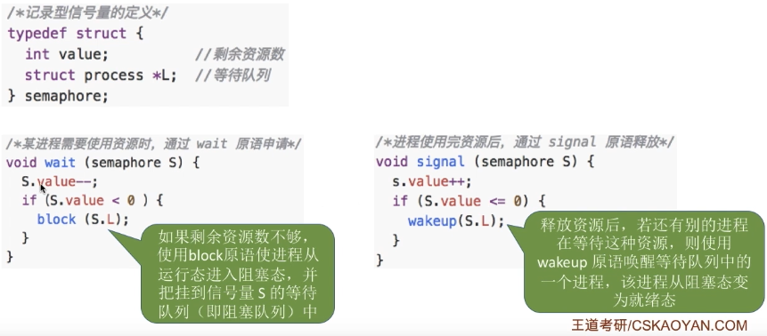

	**优点**：==遵循了让权等待==

**用信号量实现进程同步、互斥、前驱关系**

* **实现进程互斥**

	（mutex为记录型信号量，表示进入临界区的名额）

	

* **实现进程同步**

	在前操作之后执行V(S)，在后操作之前执行P(S)（==前V后P==）

	

* **实现前驱关系**

	

**生产者-消费者问题**

==实现互斥的P操作一定要在实现同步的P操作之后==、==两个V操作顺序可以交换==

**多生产者-多消费者问题**

**吸烟者问题**

**读者写者问题**

**哲学家进餐问题**

`管程`

（==可用于实现同步和互斥==）

**组成**： 1⃣️ <u>局部于管程的共享数据结构说明</u> 						   2⃣️ <u>对该数据结构进行操作的一组过程</u>

​				 3⃣️ <u>对局部于管程的共享数据设置初始值的语句</u>   4⃣️ <u>管程的名称</u>	

**基本特征**：

1⃣️ 局部于管程的数据只能被局部于管程的过程所访问（私有变量）

2⃣️ **一个进程只有通过调用管程内的过程才能进入管程访问共享数据**

3⃣️ ==每次仅允许一个进程在管程内执行某个内部过程==（由编译器实现）

**条件变量**：

当一个进程进入管程后被阻塞，直到阻塞的原因解除时，在此期间，如果该进程不释放管程，那么其他进程无法进入管程。为此，将阻塞原因定义为条件变量condition。通常，一个进程被阻塞的原因可以有多个，因此在管程中设置了多个条件变量。每个条件变量保存了一个等待队列，用于记录因该条件变量而阻塞的所有进程，对条件变量只能进行两种操作，即wait和signal。

* **X.wait**

	当X对应的条件不满足时，正在调用管程的进程调用X.wait 将自己插入X条件的等待队列，并释放管程，此时其他进程可以使用该管程

* **X.signal**

	X对应的条件发生了变化，则调用X.signal,唤醒一个因X条件而阻塞的进程

==wait、signal操作只是单纯的阻塞和唤醒并没有检查是否满足条件==

>**条件变量和信号量的比较**
>
>**相似点：**条件变量的wait、signal操作类似于信号量的P/V操作，可以实现进程的阻塞/唤醒
>
>**不同点：**条件变量是“没有值”的，仅实现了“排队等待”功能；
>
>​					而信号量是“有值”的，信号量的值反映了剩余资源数，而在管程中，剩余资源数用共享数据结构记录。
>
>​				（==区别在于PV操作有改变信号量的值，而管程的wait和signal只是阻塞和唤醒==）

**管程是被进程调用的，管程是语法范围，无法创建和撤销（类似代码段）**

`死锁`

|                             死锁                             |                        饥饿                        |
| :----------------------------------------------------------: | :------------------------------------------------: |
| 各进程互相等待对方手里的资源，导致各进程都阻塞，无法向前推进的现象 | 由于长期得不到想要的资源，某进程无法向前推进的现象 |
|            至少有**两个及以上**的进程同时发生死锁            |            **可能只有一个**进程发生饥饿            |

**产生的必要条件**：（不满足其中一个就不发生）

1⃣️ ==互斥条件==（只有对必须互斥使用的资源的争抢才会导致死锁）

2⃣️ ==不剥夺条件==（进程所获得的资源在未使用完之前，不能由其他进程强行夺走）

3⃣️ ==请求和保持条件==（进程已经保持了至少一个资源，但又提出了新的资源请求，而该资源又被其他进程占有，此时请求进程被阻塞，但又对自己已有的资源保持不放）

4⃣️ ==循环等待条件==（存在一种进程资源的循环等待链，链中每一个进程已获得的资源同时被下一个进程所请求）

==循环等待未必死锁，死锁一定有循环等待==

（<u>如果同类资源数>1，即使有也未必死锁；同类资源数=1，必有死锁</u>）

**产生死锁的根本原因**：==系统资源分配不足和进程推进顺序不合理==

`预防死锁`

**原理**：==破坏死锁产生的四个必要条件中的一个或几个==

* **破坏互斥条件**

	SPOOLing技术

	**缺点**：**很多时候都==无法破坏==互斥条件**

* **破坏不剥夺条件**

	* 当某个进程请求新的资源得不到满足时，必须立即释放保持的所有资源
	* 当某个进程需要的资源被其他进程所占有，可以由操作系统协助将想要的资源强行剥夺（考虑优先级）

	**缺点**： 1⃣️ 实现复杂 2⃣️ 反复申请和释放资源会增加系统开销，降低系统吞吐量

	​				 3⃣️ 释放资源可能造成前一阶段工作的失效（只适用于易保存和恢复状态的资源，如CPU）

* **破坏请求和保持条件**

	采用**静态分配**方法，即进程在运行前一次申请完所需要的全部资源，在它的资源未满足前，不让运行，一旦 投入运行后，这些资源一直归它所有

	**缺点**：==资源利用率低、可能导致某些进程饥饿==

* **破坏循环等待条件**

	采用**顺序资源分配法**，首先给系统中的资源编号，规定每个进程必须按编号递增的顺序请求资源，同类资源（即编号相同的资源）一次申请完；一个进程只有以占有小编号的资源时，才有资格申请更大编号的资源；已持有大编号资源的进程不可能逆向回来申请小编号的资源，从而不会产生循环等待的现象

	**缺点**： 1⃣️ 不方便增加新设备（可能需要重新分配所有的编号）

	​				 2⃣️ 导致资源浪费（进程实际使用资源的顺序可能和编号递增顺序不一致）

	​				 3⃣️ 用户编程麻烦（必须按规定次序申请资源）

`避免死锁`

**原理**：==用某种方法防止系统进入不安全状态，从而避免死锁==

**安全序列**：指如果系统按照这种序列分配资源，则每个进程都能顺利完成；只要能找出一个安全序列，系统就是<u>安全状态</u>

如果系统处于安全状态，就**一定不会**发生死锁；如果系统进入不安全状态，就**可能**发生死锁

（==处于不安全状态未必发生了死锁，但发生死锁一定是在不安全状态==）

**银行家算法**

**思想**：在进程提出资源申请时，先预判此次分配是否会导致系统进入不安全状态；如果会进入，就暂时不答应此次请求，让进程先阻塞等待

`死锁的检测和解除`

**原理**：允许死锁的发生，不过操作系统会负责检测出死锁的发生，然后采取某种措施解除死锁

**死锁检测**

**思想**：如果系统中剩余的可用资源数足够满足进程的需求，那么这个进程暂时是不会阻塞的，可以顺利地执行下去。如果这个进程执行结束了把资源归还系统，就可能使某些正在等待资源的进程被激活，并顺利地执行下去。相应的，这些被激活的进程执行完了之，后又会归还一些资源，这样可能又会激活另外一些阻塞的进程...如果按上述过程分析，<u>最终能消除所有边，就称这个图是可完全简化的。此时一定没有发生死锁(相当于能找到一个安全序列)如果最终不能消除所有边，那么此时就是发生了死锁，最终还连着边的那些进程就是处于死锁状态的进程</u>（**死锁定理**）

资源分配图==有环路未必发生死锁==，==没有环路一定没有发生死锁==（破坏了循环等待），==每种资源只有一个且出现环路必然死锁==

==$有n个进程，每个进程需要k个资源，则可能发生死锁的最大资源数为n(k-1)，不会发生死锁的最小资源数为n(k-1)+1$==

**死锁解除**

* **资源剥夺法**

	挂起(暂时放到外存上)某些死锁进程，并抢占它的资源，将这些资源分配给其他的死锁进程，但是应防止被挂起的进程长时间得不到资源而饥饿

* **撤销进程法**（终止进程法）

	强制撤销==部分、甚至全部==死锁进程，并剥夺这些进程的资源；

	**优点**：实现简单

	**缺点**：付出的代价可能会很大（因为有些进程可能已经运行了很长时间）

* **进程回退法**

	让一个或多个死锁进程回退到足以避免死锁的地步。要求系统要记录进程的历史信息，设置还原点。

**解除对象**：1⃣️ <u>进程优先级较低</u> 				 2⃣️ <u>已执行时间较少</u> 			3⃣️ <u>还需要较长时间能完成</u> 

​						 4⃣️ <u>使用更多资源的进程</u> 		5⃣️ <u>非交互式的进程</u>

### 第3章 内存管理

**流程**：<u>编译$$\rightarrow$$链接$$\rightarrow$$装入</u> 

**形成逻辑地址的阶段**：==链接==

* **静态链接**

    程序运行前，先将各目标模块及它们所需的库函数链接成一个完整的可执行程序，以后不再拆开

* **装入时动态链接**

    将各目标模块装入内存时，采用==边装入边链接==的链接方式

* **运行时动态链接**

    当程序执行中需要该目标模块时，才对它进行链接

    **优点：** ==便于修改和更新==，==便于实现对目标模块的共享==

`程序装入内存的三种方式`

* **绝对装入**

    在==编译时==，编译程序产生绝对地址的目标代码，==只适用于单道程序环境==

* **可重定位装入（静态重定位）**

    编译、链接后的装入模块的地址都是**从0开始**的，指令中使用的地址、数据存放的地址都是相对于起始地址而言的逻辑地址；地址变换是在==装入时==一次完成的（**在装入时需要对程序中的指令和数据地址进行修改，即重定位**）；==用于早期的多道批处理系统==

    **特点**：1⃣️装入内存时，需要==分配全部内存空间==				2⃣️整个运行期间==不能在内存中移动==				3⃣️==不能申请内存==

    ==只能采用固定分区存储管理==（可变分区、页式、段式❌）

* **动态运行时装入（动态重定位）**

    编译、链接后的装入模块的地址都是从0开始的，装入内存后，并不会立即把逻辑地址转换为物理地址，而是把地址转换推迟到程序真正==执行时==才进行，需要一个**重定位寄存器**的支持；==用于现代操作系统==

    **特点：** 1⃣️==可以将程序分配到不连续的存储区中==

    ​				 2⃣️==只需装入部分代码即可运行==

    ​				 3⃣️==可动态申请分配内存==
    
    ​				4⃣️ ==允许程序在内存中移动==

`内存管理功能`

* **内存空间的分配和回收**

* **地址转换**（$逻辑地址 \to 物理地址$）

* **内存空间的扩充**（实现虚拟性）

* **存储保护（内存保护）**

    **目的：** <u>保证各道作业在各自的存储空间内运行，互不干扰</u>

    * **设置一对上、下限寄存器**

        存放用户作业在主存中的上限、下限地址，每当CPU访问一个地址时，分别和两个寄存器的值相比，判断有无越界

    * **采用重定位寄存器（基址寄存器）和界地址寄存器（限长寄存器）进行越界检查**

        重定位寄存器存放**起始物理地址**，界地址寄存器存放**最大逻辑地址**

`覆盖与交换`

覆盖与交换技术是在**多道程序环境下**用来扩充内存的两种方法

* **覆盖**（同一个进程中的）

    把用户空间分成一个固定区和若干覆盖区，将经常活跃的部分放在固定区，那些即将访问的段放入覆盖区，其他段放在外存中，在需要调用前，系统再将其调入覆盖区，替换覆盖区中原有的段

    由程序员声明覆盖结构，操作系统自动完成覆盖，==只用于早期操作系统==；==只用于单一连续分配和固定分区分配==

    **缺点：** ==对用户不透明==，增加了用户编程负担

* **交换技术**（不同进程之间的）

    内存空间紧张时，系统将内存中某些进程暂时换出外存，把外存中某些已具备运行条件的进程换入内存

    **换出**：把处于==等待状态==（或在CPU调度原则下被剥夺运行权利）的程序从内存移到辅存

    **换入**：把==准备好竞争CPU==运行的程序从辅存移到内存

    1⃣️ **应该将进程保存在外存的什么位置？**

    ​		通常把磁盘空间分为文件区和对换区；

    ​		**文件区**用于存放文件，采用==离散分配==方式（==追求存储空间的利用率==）

    ​		**对换区**存放被换出的进程数据，采用==连续分配==方式（==追求换入换出速度==）
    
    ​		**对换区的I/O速度比文件区更快**
    
    2⃣️ **PCB会常驻内存，不会被换出外存**
    
    3⃣️ **换出的时机？**		==创建态、处于临界段、死锁 🉑️		I/O操作 ❌==

`连续分配管理方式`

**存储管理的目的**：==方便用户和提高内存利用率==

**内部碎片**：<u>分配给某进程的内存区域中，如果有些部分没有用上</u>

**外部碎片**：<u>内存中的某些空闲分区由于太小而难以利用</u>

* **单一连续分配**

    内存被分为系统区和用户区；系统区用于存放操作系统相关数据，用户区用于存放用户进程相关数据；==内存中只能有一道用户程序==（用户程序独占整个用户区空间）

    **优点：** **实现简单**；==无外部碎片==；**可以采用覆盖技术扩充内存**；**无须进行内存保护**

    **缺点：** ==有内部碎片==，**存储器利用率极低** ；==只能用于单用户、单任务操作系统==

    

* **固定分区分配**

    * **分区大小相等**

    	<u>适用于利用一台计算机去控制多个相同对象的场合</u>，**缺乏灵活性**

    * **分区大小不等**

    	根据系统中运行的作业大小情况进行划分（如划分多个小分区、适量中等分区、少量大分区)

    	

    **优点**：**实现简单**，==无外部碎片==

    **缺点**：1⃣️ 程序可能太大而放不进任何一个分区中，用户不得不使用覆盖技术来使用内存空间

    ​				2⃣️ 主存利用率低，==有内部碎片==

* **动态分区分配（可变分区分配）**

    不会预先划分内存分区，而是在进程==装入时==根据进程大小动态建立分区，并使分区大小正好适合进程的需要

    ==动态分区分配应使用动态重定位的装入方式==

    ==无内部碎片，有外部碎片==（外部碎片可以通过**紧凑**技术解决，即系统不时地对进程进行移动和整理，但需要动态重定位寄存器的支持）
    
    **记录内存使用情况的数据结构：**
    
    * **空闲分区表**
    
    	
    
    * **空闲分区链**
    
    	每个分区的起始、末尾部分分别设置前向指针和后向指针；起始部分还可记录分区大小信息
    
    	
    
    **动态分区分配算法**
    
    * **首次适应算法**
    
    	每次都从**低地址**开始查找（以==地址递增==的次序排列），每次分配内存时顺序查找空闲分区链（空闲分区表），找到第一个能满足大小的空闲分区
    
    	**思想**：==从头到尾找适合的分区==
    
    	**优点**：==综合性能最好；算法开销小==（不需要排列空闲分区）
    
    * **最佳适应算法**
    
    	空闲分区以==容量递增==的次序排列，每次分配内存时顺序查找空闲分区链（空闲分区表），找到第一个能满足大小的空闲分区
    
    	**思想**：==优先使用更小的分区，保留更多大分区==
    
    	**缺点**：==产生外部碎片；算法开销大==（每次都选最小的，留下了越来越多小碎片）
    
    * **最坏适应算法**（最大适应算法）
    
    	空闲分区以==容量递减==的次序排列，每次分配内存时顺序查找空闲分区链（空闲分区表），找到第一个能满足大小的空闲分区
    
    	**思想**：==优先使用更大的分区==
    
    	**缺点**：==算法开销大；可能导致大进程到达而没有大内存分区可用==（每次都选最大）
    
    * **邻近适应算法**
    
    	空闲分区以==地址递增==的顺序排列（循环链表），每次分配内存时从上次查找结束的位置开始查找空闲分区链（表），找到大小满足要求的第一个空闲分区（解决首次适应算法每次重复查找低地址部分小分区的不必要开销）
    
    	
    
    	**思想**：==每次从上次查找结束位置开始查找==
    
    	**优点**：==算法开销小==（同首次适应算法）
    
    	**缺点**：<u>邻近适应算法的规则可能会导致无论低地址、高地址部分的空闲分区都有相同的概率被使用，也就导致了高地址部分的大分区更可能被使用，划分为小分区，最后导致无大分区可用</u>

`分页存储管理`

**页框（页帧、内存块、物理块、物理页面）**：将内存空间分为一个个==大小相等==的分区，分区就是页框

**页框号（页帧号、内存块号、物理块号、物理页号）**：每个页框的编号（从0开始）

**页（页面）**：将进程的逻辑地址空间分为与页框大小相等（故==页框大小=页面大小==）的一个个部分，每个部分称为页；

​								页号也是从0开始

**页表**：为了知道进程的每个页面在内存中存放的位置，操作系统为每个进程建立一张页表

​				==一个进程对应一张页表==；==页表存在PCB中==；**存储页号不占存储空间**（隐含的）

==对主存储器的分配以块（页）为单位==

**逻辑地址（虚地址）到物理地址（实地址）的转换**

==$逻辑地址对应的物理地址=某页面在内存中的起始地址+页内偏移量$==

==$J号内存块的起始地址=J\times 内存块大小$==

==$页号=逻辑地址/页面长度（结果取整）$==、==$页内偏移量=逻辑地址\%页面长度（结果取余）$==

**结论**：==$如果每个页面大小为2^KB，用二进制数表示逻辑地址，则末尾K位为页内偏移量，其余部分为页号$==

​				==$如果有K位表示页内偏移量，则说明该系统中一个页面的大小是2^K个内存单元$==

​				==$如果有M位表示页号，则说明在该系统中，一个进程最多允许有2^M个页面$==

​				==若页面大小刚好是2的整数幂，则只需把页表记录的物理块号（二进制）拼接上页内偏移量就能得到对应的物理地址==

**基本地址变换机构**

（基本地址变换机构可以借助进程的页表将逻辑地址转换为物理地址）
通常会在系统中设置一个**页表寄存器(PTR)**，==存放页表在内存中的起始地址F和页表长度M==；进程未执行时，页表的始址和页表长度放在==进程控制块(PCB)==中，当进程被调度时，操作系统内核会把它们放到页表寄存器中

**地址变换过程**：

1⃣️ 计算页号P和页内偏移量W 

2⃣️ 比较页号P和页表长度M，若$P\ge M$，则产生越界中断，否则继续执行(页号从0开始的，页表长度至少是1，故P=M时也会越界)

3⃣️ 页表中页号P对应的$页表项地址 = 页表起始地址F+页号P*页表项长度$，取出该页表项内容b,即为内存块号

4⃣️ $物理地址E = 内存块号b*内存块大小L+页内偏移量W$，用得到的物理地址E去访存

**访存次数**：==两次==（第一次页表，第二次目标内存单元）

**具有快表的地址变换机构**

**快表（TLB）**：**联想寄存器**，用来<u>存放最近访问的页表项的副本</u>（即==用于地址变换==），==采用SRAM==；内存中的页表称为慢表

==快表中的页面一定是在内存中的==（若某个页面被换出外存，则快表中的相应表项也要删除，否则可能访问错误的页面）

**地址变换过程**：

1⃣️ CPU给出逻辑地址，由某个硬件算得页号、页内偏移量，将页号与快表中的所有页号进行比较

2⃣️ 如果找到匹配的页号，说明要访问的页表项在快表中有副本，则直接从中取出该页对应的内存块号，再将内存块号与页内偏移量拼接形成物理地址，最后访问该物理地址对应的内存单元；因此==若快表命中，则访问某个逻辑地址仅需一次访存即可==

3⃣️ 如果没有找到匹配的页号，则需要访问内存中的页表，找到对应页表项，得到页面存放的内存块号，再将内存块号与页内偏移量拼接形成物理地址，最后，访问该物理地址对应的内存单元；因此，==若快表未命中，则访问某个逻辑地址需要两次访存==（在找到页表项后，应同时将其存入快表,以便后面可能的再次访问；但若快表已满，则必须按照一定的算法对旧的页表项进行替换）

**两级页表**

**地址变换过程**：

1⃣️ 按照地址结构将逻辑地址拆分成三部分  

2⃣️ 从PCB中读出页目录表始址，再根据一级页号查页目录表，找到下一-级页表在内存中的存放位置	

3⃣️ 根据二级页号查表，找到最终想访问的内存块号

==各级页表的大小不能超过一个页面==

**访存次数**：==三次==（第一次页目录表，第二次二级页表，第三次目标内存单元）（假设没有快表）

​						 ==N级页表访问一个逻辑地址需要N+1次访存==

**优点**：==减少页表所占的连续内存空间==

`分段存储管理`

**每个段在内存中占据连续空间，但各段之间可以不相邻**

==段号的位数决定每个进程最多可以分几个段；段内地址位数决定了每个段的最大长度==

**段表**：为了从物理内存中找到各个逻辑段的存放位置，需为**每个进程**建立一张段映射表

​				==各个段表项的长度是相同的==、**段号是隐含的，不占存储空间**

**地址变换**：

通常会在系统中设置一个**段表寄存器**，==存放段表在内存中的起始地址和段表长度==；进程未执行时，段表的始址和段表长度放在==进程控制块(PCB)==中，当进程被调度时，操作系统内核会把它们放到段表寄存器中

**访存次数**：==两次==（第一次段表，第二次目标内存单元）（**分段也可以使用快表**）

> **分页与分段的对比**
>
> **分页**：==为了实现离散分配，提高内存利用率==；==分页对用户不可见==；==用户进程地址空间是一维的==；
>
> ​				==不会产生外部碎片，但会产生内部碎片==
>
> **分段**：==为了更好地满足用户需求==；==分段对用户是可见的==；==用户进程地址空间是二维的==（需要给出段名以及段内地址）
>
> ​			  ==分段比分页更容易实现信息的共享和保护==；==会产生外部碎片，不会产生内部碎片==；==有利于程序的动态链接==

`段页式存储管理`

（将进程按逻辑模块分段，再将个段分页，再将内存空间分为大小相同的内存块，各页面分别装入各内存块中）

==段号的位数决定了每个进程最多可以分几个段==；==页号位数决定了每个段最大有多少页==；==页内偏移量决定了页面大小==

==分段对用户是可见的，将各段分页对用户是不可见的==、==段页式管理的地址结构是二维的==

**段表、页表**：

==各个段表项的长度是相同的==、**段号是隐含的，不占存储空间**

==一个进程只会对应一个段表，但可能对应多个页表==（由于一个段表可能对应多个页表）；==每个进程一张段表，每个段一张页表==

**地址变换过程**：

**访存次数**：==三次==（第一次段表，第二次页表，第三次目标内存单元），**也可以使用快表，若命中只需一次访存**（目标内存单元）

`虚拟内存`

**传统存储管理方式的特征**：1⃣️ **一次性**，作业数据必须一次全部调入内存		2⃣️ **驻留性**，作业数据在整个运行期间都会常驻内存

**特征**：1⃣️ **多次性**，无需在作业运行时一次性全部装入内存，而是允许被分成多次调入内存

​				2⃣️ **对换性**，在作业运行时无需一直常驻内存，而是允许在作业运行过程中，将作业换入、换出

​				3⃣️ **虚拟性**，从逻辑上扩充了内存的容量，使用户看到的内存容量，远大于实际的容量

虚拟内存的实现需要建立在==离散分配==的内存管理方式基础上

**虚拟内存的实现**：<u>请求分页存储管理、请求分段存储管理、请求段页式存储管理</u>

**与传统分页、分段、段页式的区别**：

1⃣️ 在程序执行过程中，当所访问的信息不在内存时，由操作系统负责将所需信息从外存调入内存，然后继续执行程序

​		（==操作系统要提供请求调页（或请求调段）功能==）

2⃣️ 若内存空间不够，由操作系统负责将内存中暂时用不到的信息换出到外存

​		（==操作系统要提供页面置换（或段置换）功能==）

==虚拟内存的最大容量 =  CPU最大寻址范围；虚拟内存的实际容量 = min（内存和外存容量之和，CPU寻址范围）==

虚拟存储技术是补充内存==逻辑==空间的技术

==虚拟存储技术基于程序的局部性原理==（局部性越好，缺页率越低，虚拟存储系统越能更好地发挥作用）

`请求分页管理方式`

**请求分页存储管理页表结构**

（<u>只有写指令才需要修改“修改位”</u>）

**缺页中断机构**

在请求分页系统中，每当要访问的页面不在内存时，便产生一个缺页中断，然后由操作系统的缺页中断处理程序处理中断

此时缺页的进程阻塞，放入阻塞队列，调页完成后再将其唤醒，放回就绪队列

如果内存中有空闲块，则为进程分配一个空闲块，将所缺页面装入该块，并<u>修改页表中相应的页表项</u>

如果内存中没有空闲块，则由页面置换算法选择一个页面淘汰，<u>若该页面在内存期间被修改过，则要将其写回外存，未修改过的页面不用写回外存</u> （**缺页时未必发生页面置换**（可能还有空闲块））

**一条指令在执行期间可能产生多次缺页中断**（因为可能多次访存）；==请求分页存储管理基于局部性原理==

**具有快表机构的请求分页系统访问逻辑地址时发生缺页的地址变换过程**：

==$查快表（未命中）\to 查慢表（未调入内存）\to 调页（需要修改慢表，同时也需要将表项复制到快表）\to 查快表\to 访问目标内存单元$==

`页面置换算法`

==所有的页面置换算法都可能引起抖动现象==

* **最佳置换算法**（OPT）

	（每次选择淘汰的页面将是以后永不使用或者在以后最长时间不再被访问的页面）

	已知页面访问顺序，往后找<u>最后一个才出现</u>的页面；==缺页率最小，性能最好==；==最佳置换算法是无法实现的==

* **先进先出置换算法**（FIFO）

  （每次选择淘汰的页面是最早进入内存的页面）

  ==实现简单、算法性能差==；

  ==可能产生Belady异常==（即当为进程分配的物理块数（即驻留集）增大时，缺页次数不减反增的异常现象）

  （==Belady异常只是可能导致，并非一定导致==；分配的物理块数增加后，**缺页次数可能增加、减少或不变**）

* **最近最久未使用置换算法**（LRU）

	（每次淘汰的页面是最近最久未使用的页面）

	**实现**：在每个页面对应的页表项中，用访问字段记录该页面自上次被访问以来所经历的时间

	

	==实现困难、开销大==（**需要对所有页排序**，故==需要硬件支持==）；==算法性能好==；==基于时间局部性原理==

* **时钟置换算法**（CLOCK）

	* **简单的CLOCK算法**/**最近未用算法**（NRU）

		为每个页面设置一个访问位，再将内存中的页面都通过链接指针链接成一个循环队列；当某页被访问时，其访问位置为1；当需要淘汰一个页面时，只需检查页的访问位；如果是0，就选择该页换出；如果是1，则将它置为0，暂不换出，继续检查下一个页面，若第一轮扫描中所有页面都是1，则将这些页面的访问位依次置为0后，再进行第二轮扫描(第二轮扫描中一定会有访问位为0的页面，因此==简单的CLOCK算法选择一个淘汰页面最多会经过两轮扫描==)

	

	​			==实现简单，算法开销小==
	
	* **改进型的时钟置换算法**
	
		简单的时钟置换算法仅考虑到一个页面最近是否被访问过。事实上，如果被淘汰的页面没有被修改过，就不需要执行I/O操作写回外存；**只有被淘汰的页面被修改过时，才需要写回外存**；因此，除了考虑一个页面最近有没有被访问过之外，操作系统还应考虑页面有没有被修改过；在其他条件都相同时，**应优先淘汰没有修改过的页面**，避免I/O操作；这就是改进型的时钟置换算法的思想；修改位=0，表示页面没有被修改过；修改位=1， 表示页面被修改过；为方便讨论，用(访问位，修改位)的形式表示各页面状态，如(1，1)表示一个页面近期被访问过，且被修改过
	
		**算法规则**：（将所有可能被置换的页面排成一个循环队列）
	
		第一轮：从当前位置开始扫描到第一个(0, 0)的帧用于替换；本轮扫描不修改任何标志位
	
		（<u>第一优先级：最近没访问且没修改的页面</u>）
	
		第二轮：若第一轮扫描失败，则重新扫描，查找第一个(0,1) 的帧用于替换；本轮将所有扫描过的帧访问位设为0
	
		（<u>第二优先级：最近没访问但修改过的页面</u>）
	
		第三轮：若第二轮扫描失败，则重新扫描，查找第一个(0,0) 的帧用于替换；本轮扫描不修改任何标志位
	
		（<u>第三优先级：最近访问但没修改的页面</u>）
	
		第四轮：若第三轮扫描失败，则重新扫描，查找第一个(0, 1)的帧用于替换
	
		（<u>第四优先级：最近访问过且修改过的页面</u>）
	
		由于第二轮已将所有帧的访问位设为0，因此经过第三轮、第四轮扫描一定会有一个帧被选中，因此改进型CLOCK置换算法==选择一个淘汰页面最多会进行四轮扫描==
	
		==算法开销较小；性能也不错==

> 考虑页面置换算法，系统有m个物理块供调度，页面引用串长度为p，包含了n个不同的页号(m<n)，若采用“预调页策略”在进程运行前先调入了m个不同的页面，无论用什么算法，缺页次数不会少于 n-m

`页面分配策略`

**驻留集**：指请求分页存储管理中给进程<u>分配</u>的物理块的集合（采用虚拟存储技术后，驻留集大小一般小于进程总大小）

​					<u>若驻留集太小，会导致缺页频繁；若驻留集太大，又会导致多道程序并发度下降，资源利用率降低</u>

​					==一般驻留集大小不能小于工作集大小，否则进程运行过程中将频繁缺页==

**工作集**：指在某段时间间隔里，进程<u>实际访问</u>页面的集合

**固定分配**：操作系统为每个进程分配一组固定数目的物理块，在进程运行期间不再改变；即驻留集大小不变

**可变分配**：先为每个进程分配一定数目的物理块，在进程运行期间可根据情况做适当的增加或减少；即驻留集大小可变

**局部置换**：发生缺页时只能选进程自己的物理块进行置换

**全局置换**：可以将操作系统保留的空闲物理块分配给缺页进程，也可以将别的进程持有的物理块置换到外存再分配给缺页进程

**固定分配局部置换**：缺点是很难在刚开始就确定应为每个进程分配多少个物理块才算合理

**可变分配全局置换**：采用这种策略时，==只要某进程发生缺页都将获得新的物理块==，仅当空闲物理块用完时，系统才选择一个未锁定的页面调出；被选择调出的页可能是系统中任何一个进程中的页，因此这个被选中的进程拥有的物理块会减少，缺页率会增加

**可变分配局部置换**：==根据发生缺页的频率动态地增加或减少进程的物理块==

**何时调入页面**：

* **预调页策略**

	（预测不久之后可能访问到的页面，将它们预先调入内存）

	==主要用于进程的首次调入==（由程序员指出应该先调入哪些部分）

* **请求调页策略**

	进程在运行期间发现缺页时才将所缺页面调入内存；这种策略调入的页面一定会被访问到，但由于每次只能调入一页，而每次调页都要磁盘I/O操作，因此I/O开销较大

**从何处调入页面**：

1⃣️ 系统拥有足够的对换区空间：页面的调入、调出都是在内存与对换区之间进行，这样可以保证页面的调入、调出速度很快；在进程运行前，需将进程相关的数据从文件区复制到对换区

2⃣️ 系统缺少足够的对换区空间：凡是不会被修改的数据都直接从文件区调入，由于这些页面不会被修改，因此换出时不必写回磁盘，下次需要时再从文件区调入即可；对于可能被修改的部分，换出时需写回磁盘对换区，下次需要时再从对换区调入

3⃣️ UNIX方式：运行之前进程有关的数据全部放在，文件区，故未使用过的页面，都可从文件区调入；若被使用过的页面需要换出，则写回对换区，下次需要时从对换区调入

**抖动（颠簸）**

（刚刚换出的页面马上又要换入内存，刚刚换入的页面马上又要换出外存）

**产生抖动的主要原因**：==进程频繁访问的页面数目高于可用的物理块数（分配给进程的物理块不够）==或==页面置换算法不合理==

（王道课跟习题课两种说法我也是醉了）

### 第4章 文件管理

UNIX系统中，==所有的设备都被视为特殊文件==（区别于普通文件）

<u>从用户的角度来看</u>，**操作系统引入文件系统的目的：**==实现对文件的按名存取==

`逻辑结构`

==文件的逻辑结构是为了方便用户而设计的==

* **无结构文件**

	又称**流式文件**，文件内部的数据就是一系列二进制流或字符流组成

* **有结构文件**		     又称**记录式文件**

	每条记录由若干个数据项组成，根据各条记录的长度（占用的存储空间）是否相等，又可分为__定长记录__和__可变长记录__

	* **顺序文件**

	  文件中的记录一个接一个地顺序排列（逻辑上），各个记录<u>在物理上可以顺序存储或链式存储</u>，<u>记录是定长或可变长的</u>

	  __组织结构__：1⃣️ **串结构**，记录之间的顺序与关键字无关（按照时间顺序插入）

	  ​						 2⃣️ **顺序结构**，记录之间的顺序按关键字顺序排列

	  __是否可实现随机存取__：

	  * **链式存储**

	  	无论是定长可变长记录，==都无法实现随机存取==，每次只能从第一个记录开始依次往后查找

	  * **顺序存储**

	  	1⃣️ **可变长记录**

	  	​       ==无法实现随机存取==；每次只能从第一个记录开始依次往后查找

	  	2⃣️ **定长记录**

	  	​      ==可实现随机存取==；记录长度为L，则第i个记录存放的相对位置是i*L

	  	​      若采用串结构，无法快速找到某关键字对应的记录

	  	​      若采用顺序结构，可以快速找到某关键字对应的记录(如折半查找)

	  考试题目所说的“顺序文件”指的是<u>物理上顺序存储的顺序文件</u>

	  __缺点__: ==增加/删除一个记录比较困难==

	* __索引文件__

	  对于可变长记录文件，系统开销较大，为此可以建立一张索引表以加快检索速度，==索引表本身是定长记录的顺序文件==

	  

	* __索引顺序文件__
	
		跟索引文件一样会为文件建立一张索引表，不同的是：并不是每个记录对应一个索引表项，而是先分组，一组记录对应一个索引表项
	
		==索引文件的索引表一定要保证按关键字有序排列，而索引顺序文件的索引表不一定有序==，因此查询索引顺序文件的索引表时，一般使用**顺序查找**
		
		**平均查找次数**：若一个顺序文件有10000个记录，则根据关键字检索文件，只能从头开始顺序查找，平均须查找5000个记录；若采用索引顺序文件结构，可把10000个记录分为100组，每组100个记录，则需要先顺序查找索引表找到分组(共100个分组，因此索引表长度为100，平均需要查50次)，找到分组后，再在分组中顺序查找记录(每个分组100个记录，因此平均需要查50次)。可见，采用索引顺序文件结构后，<u>平均查找次数减少为50+50= 100次</u>
		
		
		
	* **多级索引顺序文件**
	
	  （同索引顺序文件，只不过多了一级）
	
	  

`文件目录`

**文件控制块**（FCB）

（用来存放控制文件需要的各种信息的数据结构）

**文件目录**：==FCB的有序集合；一个FCB就是一个文件目录项==

**目录文件**：为了实现对文件目录的管理，通常将文件目录以文件的形式保持在外存，这个文件就叫目录文件

​						 （存放该目录中所有子目录文件和数据文件的目录项）

**主要包含**：1⃣️ **基本信息**（==文件名、文件的物理地址==、文件的逻辑结构、文件的物理结构）

​						 2⃣️ **存取控制信息**（__文件存取权限__）		3⃣️ **使用信息**（文件建立时间、修改时间）

**索引结点**

在文件目录中的每个目录项==仅由文件名和指向该文件所对应的索引结点的指针构成==

==检索文件时磁盘I/O的次数减少==（由于每个目录项长度减小，因此每个磁盘块可以存放更多的目录项）

存放在磁盘上的索引结点称为__磁盘索引结点__；当索引结点放入内存后称为__内存索引结点__；

（<u>内存索引结点需要增加信息</u>，如文件是否被修改，访问该文件的进程数）

**目录结构**

* **单级目录结构**

    实现了按名存取，但==不允许文件重名==，==查找速度慢、不便于文件共享==；==不适用于多用户操作系统==

* **两级目录结构**

    分为主文件目录和用户文件目录

    **主文件目录**：记录用户名及相应用户文件目录所在的存储位置；**用户文件目录**：记录该用户的文件PCB信息

    ==允许不同用户的文件重名==，但__缺乏灵活性__，==不能对文件分类==

* **多级目录结构**（树形目录结构）

    不同目录下的文件可以重名，==便于实现文件分类==，但==不便于实现文件共享==

    **设置当前工作目录的目的**：==加快文件的检索速度==；**采用多级目录结构的目的**：==解决命名冲突==

* **无环图目录结构**

    可为每个共享结点设置一个共享计数器；每当增加对该结点的共享链时，计数器加1；每当删除该结点时，计数器减1

    ==仅当计数器为0时，才真正删除该结点==，否则仅删除请求用户的共享链

    <u>其中一个用户修改文件数据时，所有用户都可以看到文件数据的变化</u>

`文件的基本操作`

* **创建文件**

​			<u>进行create系统调用时，需要提供的参数有</u>：1⃣️ 所需的外存空间大小  2⃣️ 文件存放路径  3⃣️ 文件名

​			**操作**：1⃣️ 在外存中找到文件所需的空间	2⃣️ 创建该文件对应的目录项 

* **删除文件**

​			<u>进行delete系统调用时，需要提供的参数有</u>：1⃣️ 文件名  2⃣️ 文件存放路径 

​			**操作**：1⃣️ 找到文件名对应的目录项	2⃣️ 回收文件占用的磁盘块	3⃣️ 删除文件对应的目录项 

* **打开文件**

​			<u>进行open系统调用时，需要提供的参数有</u>：1⃣️ 文件名  2⃣️ 文件存放路径  3⃣️ 要对文件的操作类型（如只读、读写）

​			**操作**：1⃣️ 在目录中找到文件名对应的目录项，并检查是否有指定的操作权限

​							2⃣️ 将目录项复制到内存中的“打开文件表”中，并将表中编号返回给用户，之后用户使用编号指明要操作的文件

​							3⃣️ 系统的打开文件表中每个文件都有一个“打开计数器”，用以记录多少进程打开了该文件

* **关闭文件**

​		  **操作**：1⃣️ 将进程的打开文件表相应表项删除	2⃣️ 回收分配给该文件的内存空间等资源

​						  3⃣️ 系统打开文件表的打开计数器count减1，若count = 0则删除对应表项:

* **读文件**

​		  <u>进行read系统调用时，需要提供的参数有</u>：

​		  **操作**：1⃣️ 哪个文件（==read系统调用不需要提供文件名，而是文件描述符==） 2⃣️ 读入多少数据 3⃣️ 放在内存的位置

* **写文件**

​		  <u>进行write系统调用时，需要提供的参数有</u>：

​		  **操作**：1⃣️ 哪个文件（==write系统调用不需要提供文件名，而是文件描述符==） 2⃣️ 写出多少数据 3⃣️ 放在内存的位置

`文件共享`

* **基于索引结点的共享方式**（硬链接）

​		  索引结点设置一个链接计数变量count，用于表示链接到本索引结点上的用户目录项数

​		  count > 0时，用户删除文件只能将count减1，然后删除自己目录中的相应目录项，其他用户仍然可以使用该文件

​		  count = 0时，表示没有用户使用该文件，系统负责删除该文件

​		  **各个用户的目录项指向同一个索引结点**

* **基于符号链的共享方式**（软链接）

​		  只有文件的拥有者才拥有指向其索引结点的指针，而共享该文件的其他用户只有该文件的路径名，

​		  并不拥有指向其索引结点的指针

`文件保护`

* **口令保护**

​		  ==口令一般存放在文件对应的FCB或索引结点中==

​		  __优点__：<u>时间和空间开销不多</u>		  					__缺点__：口令直接存在系统内部，<u>不够安全</u>

* **加密保护**

	__优点__：==保密性强==，节省了存储空间			   __缺点__：<u>加密、解密要花费一定的时间</u>

	==不由系统实现==

* **访问控制**

	在==每个文件==的FCB（或索引结点）中增加一个访问控制列表，该表记录了各个用户可以对该文件执行哪些操作

	**优点**：==实现灵活==（可以实现复杂的文件保护功能）；					==由系统实现==

	==相比于加密保护，访问控制安全性较差==

==对一个文件的访问，常由用户访问权限和文件属性共同限制==

`文件系统的全局结构`

* **文件系统在磁盘中的结构**

* **文件系统在内存中的结构**

	

`虚拟文件系统`

**特点**：1⃣️ 向上层用户进程提供统一标准的系统调用接口，屏蔽底层具体文件系统的实现差异

​				2⃣️ VFS要求下层的文件系统必须实现某些规定的函数功能（要求下层文件系统实现VFS提供的接口）

​				3⃣️ 每打开一个文件，VFS就在内存中新建一个vnode（==只存在于主存中==），用统一的数据结构表示文件，

​						无论该文件存储在哪个文件系统

**为了实现虚拟文件系统，Linux主要抽象了四种对象类型**：==超级块对象、索引结点对象、目录项对象和文件对象==

`文件系统挂载`

**过程**：1⃣️ 在VFS中注册新挂载的文件系统，内存中的挂载表包含每个文件系统的相关信息（文件系统类型、容量大小等）

​				2⃣️ 新挂载的文件系统，要向VFS提供一个函数地址列表

​				3⃣️ 将新文件系统加到挂载点（即将新文件系统挂载在某个父目录下）

`文件分配方式（物理结构）`

==操作系统为文件分配存储空间以块为单位==；==物理结构的选择取决于文件系统设计者针对硬件结构所采取的策略==

**连续分配**

每个文件在磁盘上占有一组连续的块；连续分配==支持顺序访问和直接访问（随机访问）==，只需访问磁盘一次

__优点__：实现简单、==连续分配的文件在顺序存取时速度最快==（相邻存放，移动磁头时间短）

__缺点__：==不方便拓展==、==存储空间利用率低==、==会产生外部碎片==

==磁带只能采用连续分配==；

**链接分配**

* **隐式链接**（默认方式）

    __优点__：==方便文件拓展==，==不产生外部碎片==，==存储利用率高==

    __缺点__：==查找效率低==（无法直接访问盘块，只能通过指针顺序访问文件，读入i号逻辑块，需要i+1次磁盘I/O），且盘块指针会消耗一定存储空间；==只支持顺序访问==

    

* **显式链接**

    __文件分配表(FAT)__：==整个磁盘只设置一张==，每个表项存放对应块的下一块链接指针，即下一个盘块号，开机时将FAT读入内存，并**常驻内存**

    从文件目录项中找到起始块号，查询**内存中**的文件分配表，找到逻辑块号对应的物理块号，==逻辑块号转换成物理块号的过程不需要读磁盘操作==

    ==既支持顺序访问，也支持随机访问==

    **优点**：相比隐式链接，==文件访问效率更高==（地址转换不需要访问磁盘）；==不会产生外部碎片，方便空间拓展==

    **缺点**：文件分配表__需要占用一定的存储空间__

    

**索引分配**

==为每个文件建立一张索引表==，索引表记录了文件的各个逻辑块对应的物理块

索引表存放的磁盘块称为<u>索引块</u>，文件数据存放的磁盘块称为<u>数据块</u>

__缺点__：索引表(块)__需要占用一定的存储空间__		__优点__：==支持随机访问==，==没有外部碎片==，==容易实现文件拓展==

（索引块太小无法支持大文件，为解决此问题引入以下方案）

* **链接方案**

    （将多个索引块链接起来，类似链表）；				**缺点**：==效率低==

    

* **多层索引**

    > 假设磁盘块大小为1KB，一个索引表项占4B，则一个磁盘块只能存放256个索引项
    >
    > 若某文件采用两层索引，则该文件的最大长度？
    >
    > $256*256*1KB = 65536KB = 64MB$ 

    ==$采用k层索引结构，且顶级索引表未调入内存，则访问一个数据块只需要k+1次读磁盘操作$==

    __缺点__：==即使是小文件，访问一个数据块依然需要k+1次读磁盘==

    

* **混合索引**

    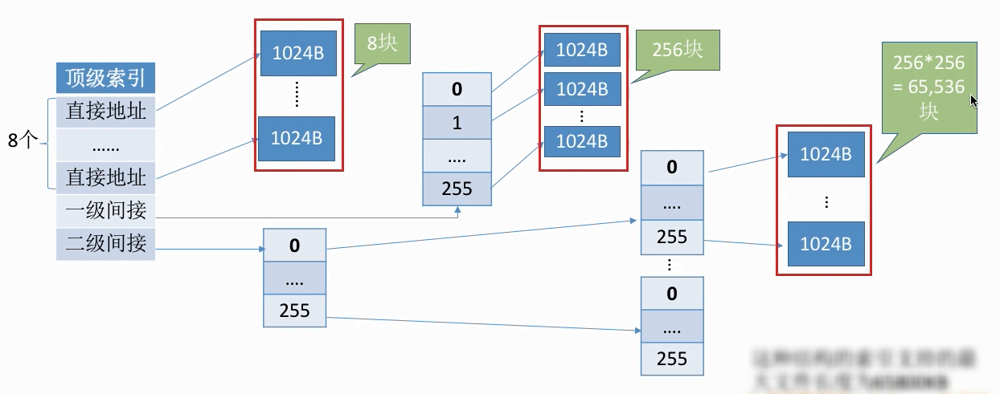

    **读磁盘次数**：若顶级索引表还未读入内存，则1⃣️ 访问0\~7号逻辑块，两次2⃣️ 访问8\~263，三次3⃣️ 访问264~65799，四次

    __优点__：<u>对于小文件，读磁盘次数更少</u>

`文件存储空间管理`

**存储空间的初始化**：将各个文件卷划分为目录区、文件区

**目录区**：存放文件目录信息(FCB)、用于磁盘存储空间管理的信息		**文件区**：用于存放文件数据

==文件对存储空间管理本质上是对外存空闲区的组织和管理==

==空闲表法和空闲链表法都不适用于大型文件系统（因为空闲表或空闲链表可能过大）==

**空闲表法**

==适用于连续分配方式==		**如何分配**：首次适应、最佳适应、最坏适应算法（同内存的动态分区分配算法）

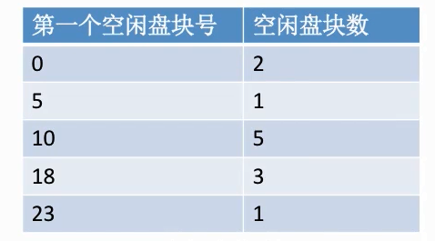

**空闲链表法**

* __空闲盘块链__

​		（以盘块为单位组成一条空闲链）

​		==操作系统保存着链头、链尾指针==；空闲盘块中存储着下一个空闲盘块的指针；==适用于离散分配的物理结构==

​		**分配**：从链头开始摘下k个盘块，并修改空闲链的链头指针		**回收**：回收的盘块依次挂到链尾，并修改链尾指针

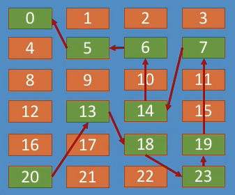

* __空闲盘区链__

	（以盘区为单位组成一条空闲链，连续的空闲盘块组成一个空闲盘区）

​		==操作系统保存链头、链尾指针==；空闲盘区中的第一个盘块内记录了盘区的长度、下一个盘区的指针

​		**如何分配**：若某文件申请K个盘块，则可以采用首次适应、最佳适应等算法，从链头开始检索，按照算法规则找到

​		一个大小符合要求的空闲盘区，分配给文件；若没有合适的连续空闲块也可以将不同盘区的盘块同时分配给一个文件，

​		注意分配后可能要修改相应的链指针、盘区大小等数据

​		**如何回收**：若回收区和某个空闲盘区相邻，则需要将回收区合并到空闲盘区中；若回收区没有和任何空闲区相邻，

​		将回收区作为单独的一个空闲盘区挂到链尾

​		==离散分配、连续分配都适用==；==相比空闲盘块链，为一个文件分配多个盘块时效率更高==（不需要多次摘下链表指针）

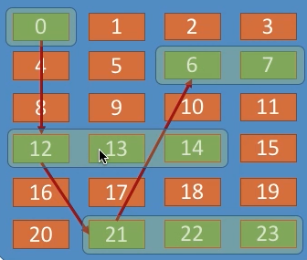

**位示图法**

==连续分配、离散分配都适用==

__盘块号、字号、位号从0开始__：==$盘块号b=ni+j$；$字号i=b/n$；$位号j=b\%n$==

__盘块号、字号、位号从1开始__：==$盘块号b=n(i-1)+j$；$字号i=(b-1)/n+1$；$位号j=(b-1)\%n+1$==

**如何分配**：（若文件需要k个块）

1⃣️ 顺序扫描位示图，找到K个相邻或不相邻的“0”	2⃣️ 根据字号、位号算出对应的盘块号，将相应盘块分配给文件

3⃣️ 将相应位设置为“1”

**如何回收:**

1⃣️ 根据回收的盘块号计算出对应的字号、位号		2⃣️ 将相应二进制位设为“0”

**成组链接法**

__如何分配__：

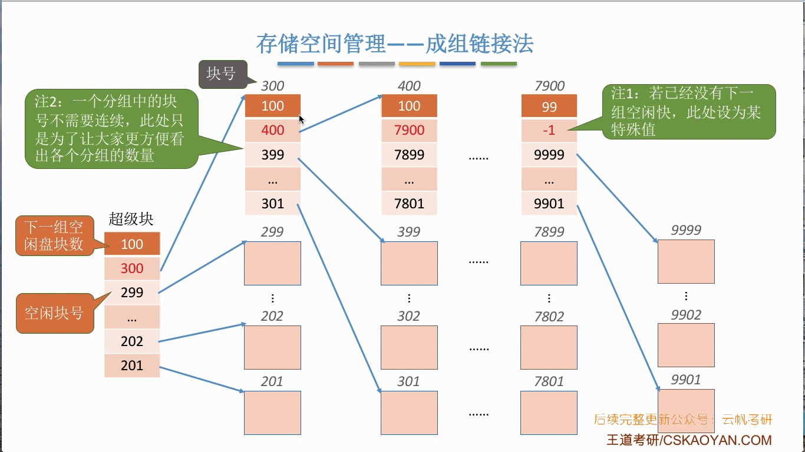

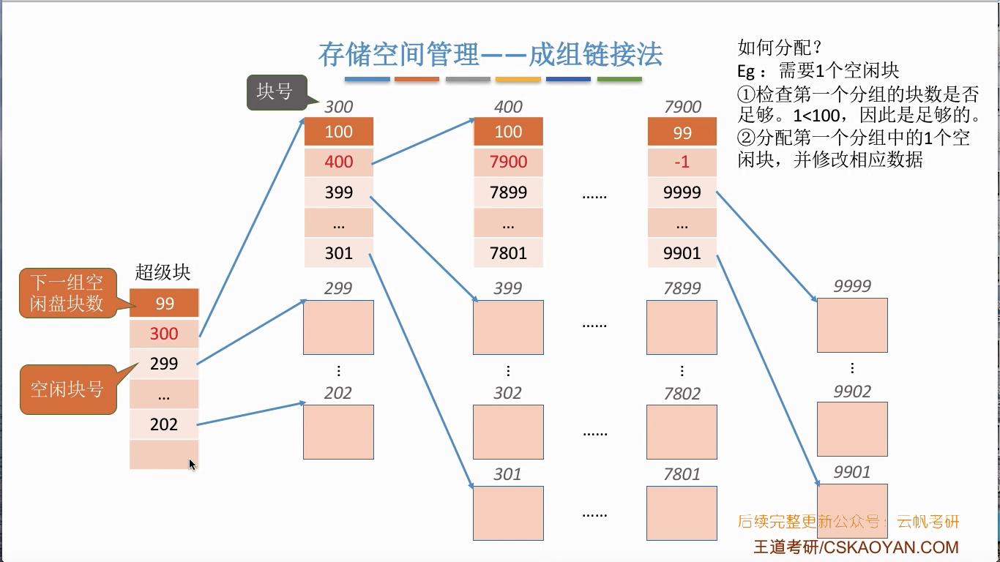

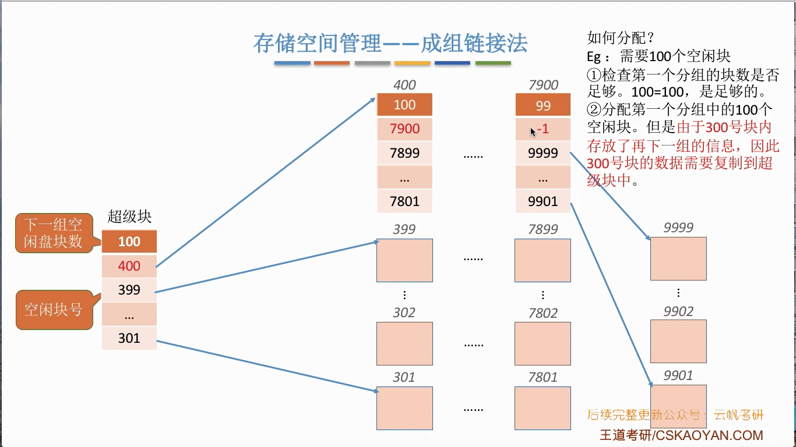

__如何回收__：

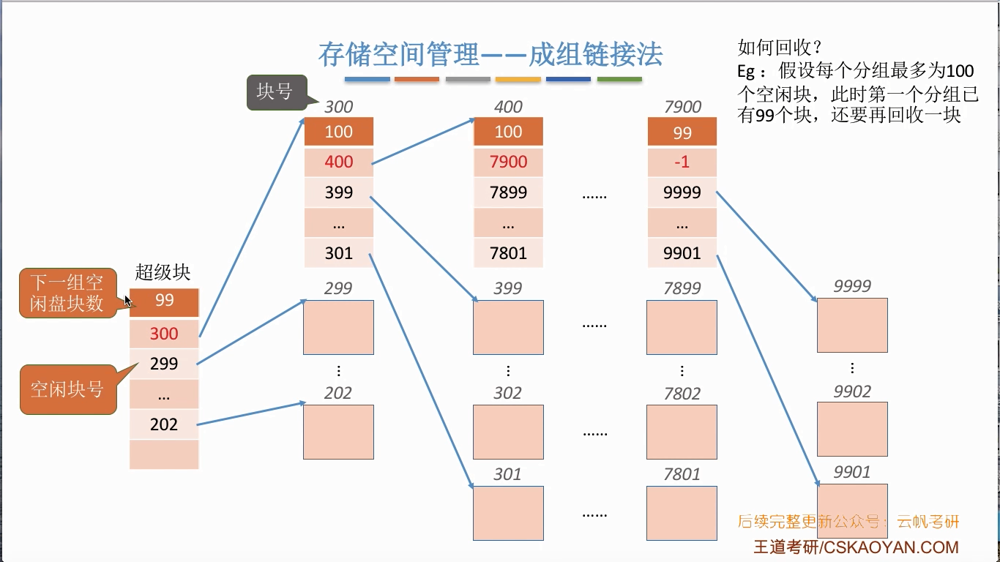

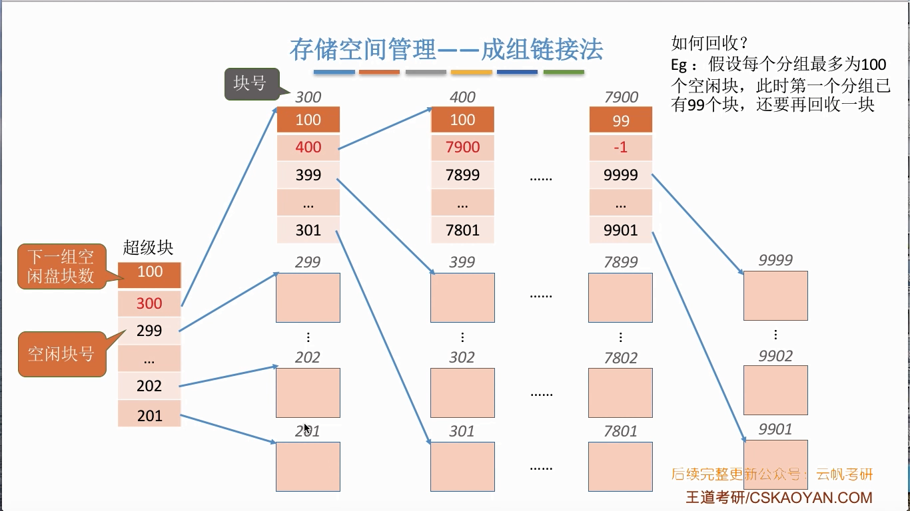

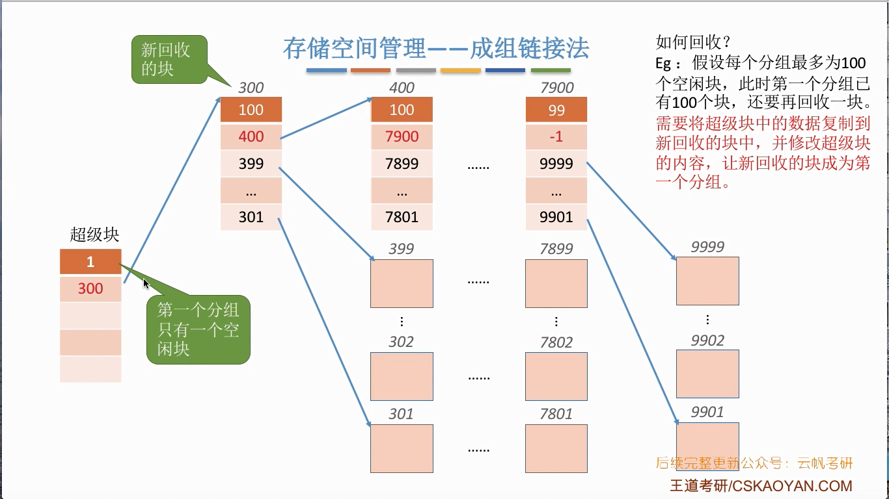

`磁盘组织与管理`

**磁盘的结构**

1⃣️ __磁道__：（一个圈）		2⃣️ __扇区__：（扇形内的一行）又称盘块，__每个扇区固定存储大小__（通常512B）密度从最外道向里道增加（最内侧的扇区面积最小，因此__数据密度最大__）

3⃣️ __磁头__：每个盘面对应一个磁头，所有磁头固定在一起，与磁盘中心的距离相同且__一起移动__

4⃣️ __柱面__：所有盘片上相对位置相同的磁道组成柱面

5⃣️ __活动头磁盘__：磁头可以移动，磁臂可以来回伸缩来带动磁头定位磁道	__固定头磁盘__：磁头不可移动，每个磁道有一个磁头

6⃣️ __可换盘磁盘__：盘片可以更换			__固定盘磁盘__：盘片不可更换

**性能参数**

延迟时间和传输时间都与磁盘旋转速度相关，为线性相关；转速是硬件固有属性，故==操作系统无法优化延迟时间和传输时间==

* **寻找时间**

	（又称寻道时间，指活动头磁盘在读写信息前，将磁头移动到指定磁道所需要的时间）

	==$T_s=m\times n + s$==（n：跨越的磁道数；m：每跨越一个磁道的耗时，约为0.2ms；s：磁臂的启动时间，约为2ms）

* **旋转延迟时间**

	（指磁头定位到某一磁盘的扇区所需要的时间）

	==$T_r=\frac{1}{2}\times\frac{1}{r}=\frac{1}{2r}$==（r：磁盘的旋转速度；1/r就是转一圈需要的时间，找到目标扇区平均需要转半圈，因此再乘以1/2）

* **传输时间**

	（指从磁盘读出或向磁盘写入数据所经历的时间）

	==$T_t=\frac{1}{r}\times\frac{b}{N}=\frac{b}{rN}$==（r：磁盘的旋转速度；b：读/写的字节数；N：每个磁道上的字节数）

**调度算法**

* **先来先服务算法**（FCFS）

	（根据进程请求访问磁盘的先后顺序进行调度）

	__优点__：==公平==					__缺点__：==性能差，寻道时间长==

* **最短寻找时间优先**（SSTF）

	（优先处理与当前磁头最近的磁道）

​			__优点__：性能较好（比FCFS算法好），平均寻道时间较短

​			__缺点__：==可能产生饥饿现象==（原因：磁头在一个小区域内来回来去地移动）

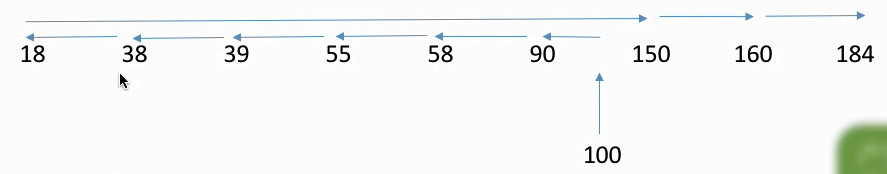

* **扫描算法**（SCAN）

	（又称电梯算法，磁头当前移动方向上选择与当前磁头所在磁道距离最近的请求作为下一次服务的对象）

​			==只有磁头移到最外侧磁道的时候才能往内移动，移到最内才能往外移动==

​			__优点__：性能较好，平均寻道时间较短

​			__缺点__：1⃣️ ==只有到达最边上的磁道时，才能改变磁头移动方向==	2⃣️ ==对各个位置磁道的响应频率不平均==

* **LOOK调度算法**

	（SCAN算法的改进，如果在磁头移动方向上已经没有别的请求，就可以立即改变磁头移动方向）

	**优点**：比起SCAN算法，不需要每次都移动到最外侧或最内侧才改变磁头方向，使寻道时间进一步缩短

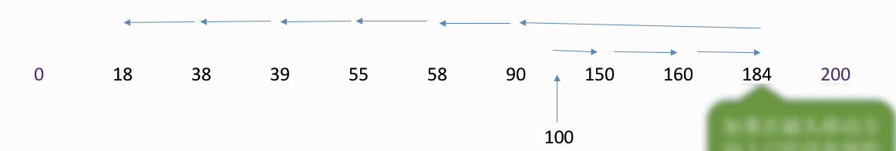

* **循环扫描算法**（C-SCAN）

	（规定只有磁头朝某个特定方向移动时才处理磁道访问请求，只有到了最边上的磁道才能改变磁头移动方向，

	而返回时直接快速移动至起始端而不处理任何请求）

	**优点**：比起SCAN ，对于各个位置磁道的响应频率很平均

	**缺点**：只有到达最边上的磁道时才能改变磁头移动方向，事实上处理了184号磁道的访问请求之后就不需要再往右移动磁头

	​				并且磁头返回时其实只需要返回到18号磁道即可，不需要返回到最边缘的磁道；比起SCAN算法来，平均寻道时间更长

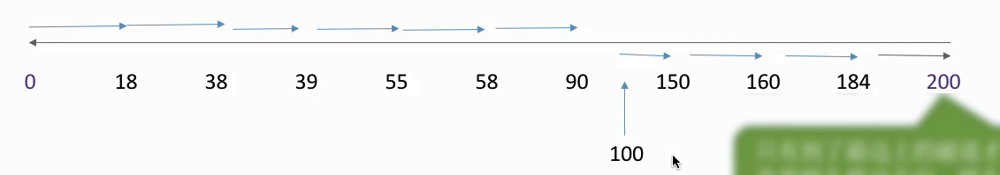

* **C-LOOK调度算法**

	（C-SCAN算法的改进；如果磁头移动的方向上已经没有磁道访问请求，就可以让磁头返回且磁头只需要返回到有磁道访问请求的位置即可）

	**优点**：比起C-SCAN算法，不需要每次都移动到最外侧或最内侧才改变磁头方向，使寻道时间进一步缩短

（若题目中无特别说明，则SCAN就是LOOK，C-SCAN就是C-LOOK）

**减少磁盘延迟时间的方法**

（磁头读入一个扇区数据后需要一小段时间处理，而盘片又在不停地旋转；如果逻辑上相邻的扇区在物理上也相邻，则读入几个连续的逻辑扇区，可能需要很长的延迟时间）

* **交替编号**

	（让逻辑上相邻的扇区在物理上有一定的间隔，可以使读取连续的逻辑扇区所需要的延迟时间更小）

* **错位命名**

	（让相邻盘面的扇区编号错位）

	

> 为什么==磁盘的物理地址是（柱面号，盘面号，扇区号）==而不是（盘面号，柱面号，扇区号）？
>
> 读取地址连续的磁盘块时，采用（柱面号，盘面号，扇区号）的地址结构==可以减少磁头移动消耗的时间==

`磁盘的管理`

**磁盘初始化**

* **低级初始化**（物理初始化）

    （出厂前）<u>将磁盘的各个磁道划分为扇区</u>，一个扇区可分为头、数据区域、尾三部分

    管理扇区所需要的各种数据结构一般存放在头、尾两部分，包括扇区校验码（奇偶校验、CRC循环冗余校验码）

* **磁盘分区**

    每个分区由若干个柱面组成（即分为C盘、D盘等）

* **逻辑格式化**

    创建文件系统，包括创建文件系统的根目录、初始化存储空间管理所用的数据结构（如位示图、空闲分区表）

**坏块**

* **对于简单的磁盘**，可以在逻辑格式化时对整个磁盘进行坏块检查，在FAT表上会标明（==坏块对系统不透明==）
* **对于复杂的磁盘**，进行低级格式化时将一些块保留作为备用（==对系统透明==），这种方案称为__扇区备用__

### 第5章 I/O管理

`I/O管理概述`

**I/O设备分类**

* __按使用特性__

	* __人机交互类外部设备__				鼠标、键盘		==数据传输速度慢==
	
	* __存储设备__                                 磁盘     ==速度较快==
	
	* __网络通信设备__                         调制解调器         **数据传输速度介于上述两者之间**

* __按传输速率__

	* **低速设备**                                 鼠标、键盘
	
	* **中速设备**                                 打印机
	
	* **高速设备**                                 磁盘

* **按信息交换单位**

	* **块设备**
	
		磁盘	**数据传输基本单位**：==块==     ==传输速率较高==；==可寻址==（即可随机地读/写任一块）；==采用DMA控制方式==
	
	* **字符设备**
	
		鼠标，键盘	**数据传输基本单位**：==字符==     ==传输速率较低==，==不可寻址==，==采用中断驱动方式==
	

`I/O控制器（设备控制器）`

（CPU无法直接控制I/O设备的机械部件，因此I/O设备还要有一个电子部件作为CPU和I/O设备机械部件之间的“中介”，

用于实现CPU对设备的控制）

**功能**：1⃣️ **接受和识别CPU发出的命令**

​						CPU发来的read/write命令，I/O控制器中会有相应的控制寄存器来存放命令和参数

​				2⃣️ **向CPU报告设备的状态**

​						I/O控制器中会有相应的状态寄存器，用于记录I/O设备的当前状态。如1表示空闲，0表示忙碌

​				3⃣️ **数据交换**

​						 I/O控制器中会设置相应的数据寄存器；输出时，数据寄存器用于暂存CPU发来的数据，之后再由控制器传送设备；

​						 输入时，数据寄存器用于暂存设备发来的数据，之后CPU从数据寄存器中取走数据

​				4⃣️ **地址识别**

​						类似于内存的地址，为了区分设备控制器中的各个寄存器，也需要给各个寄存器设置一个特定的“地址”；

​						I/O控制器通过CPU提供的地址来判断CPU要读/写的是哪个寄存器

**组成**：

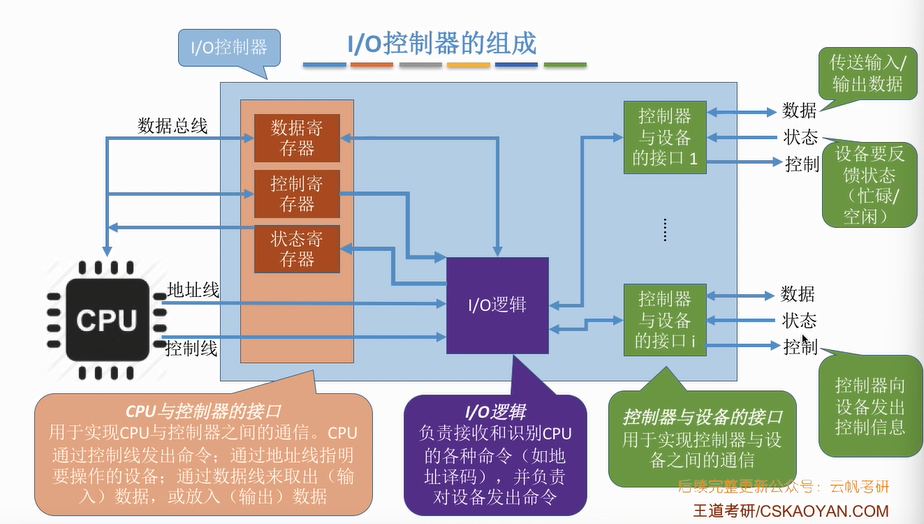

**注意**： 1⃣️ ==一个I/O控制器可能对应多个设备==

​				2⃣️ ==数据寄存器、控制寄存器、状态寄存器可能有多个==（对应各个设备），且这些寄存器都要有相应的地址

​				3⃣️ ==I/O逻辑用于实现设备控制功能==

**寄存器编址方式：**

* **内存映像I/O**				 占用内存地址的一部分

* **寄存器独立编址**       采用I/O专用地址

`IO控制方式`

* **程序直接控制方式**

	**读/写的流程**：

	1⃣️ CPU向控制器发出读指令，于是设备启动，并且状态寄存器设为1 （未就绪）

	2⃣️ ==轮询==检查控制器的状态

	3⃣️ 输入设备准备好数据后将数据传给控制器，并报告自身状态

	4⃣️ 控制器将输入的数据放到数据寄存器中，并将状态改为0 （已就绪）

	5⃣️ CPU发现设备已就绪，即可将数据寄存器中的内容读入CPU的寄存器中，再把CPU寄存器中的内容放入内存

	6⃣️ 若还要继续读入数据，则CPU继续发出读指令

	**CPU干预频率**：==很频繁==（<u>I/O操作开始前、完成后需要CPU介入且等待过程中CPU需要轮询</u>）				

	**数据传送的单位**：==每次读/写一个字==

	**数据的流向**：1⃣️ 读操作：==$I/O设备\to CPU寄存器\to 内存$==  2⃣️ 写操作：==$内存\to CPU寄存器 \to I/O设备$==

	**优点**：==实现简单==				**缺点**：==CPU利用率低==（<u>CPU和I/O设备只能==串行==工作；CPU需要一直轮询检查，长期处于忙等</u>）

* **中断驱动方式**

	引入中断机制，由于I/O设备速度很慢，因此在CPU发出读/写命令后，可将等待I/O的进程阻塞，先切换到别的进程执行；当I/O
	完成后，控制器会向CPU发出一个中断信号，CPU检测到中断信号后，会保存当前进程的运行环境信息，转去执行中断处理程序处理该中断。处理中断的过程中，CPU从I/O控制器读一个字的数据传送到CPU寄存器，再写入主存；接着CPU恢复等待I/O的进程的运行环境，然后继续执行

	**CPU干预频率**：<u>I/O操作开始前、完成后需要CPU介入，等待过程中CPU可以切换到别的进程执行</u>

	**数据传送的单位**：==每次读/写一个字==

	**数据的流向**：1⃣️ 读操作：==$I/O设备\to CPU寄存器\to 内存$==    2⃣️ 写操作：==$内存\to CPU寄存器 \to I/O设备$==

	**优点**：==CPU和I/O设备可并行工作==；<u>CPU利用率得到提升</u>				**缺点**：<u>中断处理会消耗较多的CPU时间</u>

* **DMA方式**

	（直接存储器存取，主要==用于块设备的I/O控制==）

	**读/写的流程**：

	1⃣️ CPU指明此次要进行的操作（读/写）、要读入多少数据、数据存放在内存的位置、数据在外部设备上的地址(如在磁盘上的地址)

	2⃣️ 控制器会根据CPU提出的要求完成数据的读/写工作，整块数据的传输完成后，才向CPU发出中断信号

	**CPU干预频率**：<u>仅在I/O操作开始前、完成后需要CPU介入</u>                 **数据传送的单位**：==每次读/写一个或多个块==

	（==每次读写的只能是连续的多个块，且这些块读入内存后在内存中也必须是连续的==）

	**数据的流向**：1⃣️ 读操作：==$I/O设备\to 内存$==     2⃣️ 写操作：==$内存 \to I/O设备$==
	
	**优点**：==CPU和I/O设备可并行工作==；<u>CPU利用率得到提升</u>
	
	**缺点**：CPU每发出一条I/O指令，<u>只能读/写连续的块</u>（如果是离散的块，CPU就必须发出多条指令）
	
	**DMA控制器**：
	
	==微观上DMA控制器每次从I/O设备读/写一个字到内存，而不是一个块==（宏观上一个块）
	
	

* **通道控制方式**

	（通道，一种硬件，弱鸡版的CPU；==通道与CPU共享内存==）

	**读/写的流程**：

	1️⃣ CPU向通道发出I/O指令，指明通道程序在内存中的位置并指明要操作的是哪个I/O设备；之后CPU就切换到其他进程

	2️⃣ 通道执行内存中的通道程序（其中指明了要读/写多少数据，读/写的数据放在内存的位置等信息)

	3️⃣ 通道执行完规定的任务后，向CPU发出中断信号，之后CPU对中断进行处理

	**CPU干预频率**：<u>仅在I/O操作开始前、完成后需要CPU介入</u>                 **数据传送的单位**：==每次读/写一组数据块==

	**数据的流向**：（在通道的控制下）1⃣️ 读操作：==$I/O设备\to 内存$==     2⃣️ 写操作：==$内存 \to I/O设备$==

	**优点**：==CPU、通道和I/O设备可并行工作==；<u>资源利用率很高</u>         **缺点**：实现复杂，需要专门的通道硬件支持
	
	

`I/O软件层次结构`

（需要记住各个层次之间的顺序）

* __用户层软件__

    用户层软件实现了<u>与用户交互的接口</u>，用户可直接使用该层提供的、与I/O操作相关的库函数对设备进行操作

    将用户请求翻译成格式化的I/O请求，并==通过“系统调用”请求操作系统内核的服务==

* __设备独立性软件__（设备无关性软件）

    1️⃣ **向上层提供系统调用**		2️⃣ **设备保护**（访问权限等，类似文件保护）	

    3️⃣ **差错处理**（对设备产生的错误进行处理）     4️⃣ **设备的分配与回收**

    5️⃣ **数据缓存区管理**（可以通过缓冲技术屏蔽设备之间数据交换单位大小和传输速度的差异）

    6️⃣ **==建立逻辑设备名到物理设备名的映射关系==，根据设备类型选择调用相应的驱动程序**

    

    ​		**系统可以采用两种方式管理逻辑设备表**（LUT，windows中是设备映射表DMT）：

    ​		1⃣️ **整个系统只设置一张LUT**，意味着==所有用户不能使用相同的逻辑设备名==，故==只适用于单用户系统==

    ​		2⃣️ **为每个用户设置一张LUT**，各个用户使用的==逻辑设备名可以重复==，==适用于多用户操作系统==

    7️⃣ **I/O调度**，用某种算法确定一个好的顺序来处理各个I/O请求

    <u>将系统中的每台设备按某种原则统一进行编号，作为区分硬件和识别设备的代号，该编号为绝对号/物理设备名</u>

    <u>设备独立性是指用户在编程时使用的设备与实际设备无关；用户程序中只需指明I/O使用的设备类型即可</u>

* **设备驱动程序**

    （设置设备寄存器，检查设备状态；==需要和硬件打交道==）

* **中断处理**

    （==需要和硬件打交道==）

    

* **硬件设备**              通常包括一个机械部件和一个电子部件（I/O控制器）

`输入/输出管理`

**输入/输出应用程序接口**

* **字符设备接口**

	**get/put系统调用**：向字符设备读/写一个字符

* **块设备接口**

	**read/write系统调用**：向块设备的读写指针位置读/写多个字符；			**seek系统调用**：修改读写指针位置

* **网络设备接口**（网络套接字接口）

	**socket系统调用**：创建一个网络套接字，需指明网络协议(TCP/UDP )		**bind**：将套接字绑定到某个本地端口

	**connect**：将套接字连接到远程地址						**read/write**：从套接字读/写数据

**阻塞I/O**：应用程序发出I/O系统调用，进程需转为阻塞态等待（如从键盘读一个字符）

**非阻塞I/O**：应用程序发出I/O系统调用，系统调用可迅速返回，进程无需阻塞等待（如往磁盘写数据）

**设备驱动程序接口**

操作系统规定好设备驱动程序的接口标准，各厂商必须按要求开发设备驱动程序

`I/O核心子系统`

__提供的服务__：==I/O调度、缓冲与高速缓存、设备分配与回收、假脱机、设备保护和差错处理==

`假脱机技术(spooling技术)`

（==在用户层软件层次实现==）

**输入井**：用于收容I/O设备输入的数据					**输出井**：用于收容用户进程输出的数据

**输入缓冲区**：在输入进程的控制下，输入缓冲区用于暂存从输入设备输入的数据，之后再转存到输入井中

**输出缓冲区**：在输出进程的控制下，输出缓冲区用于暂存从输出井送来的数据，之后再传送到输出设备上

==（输入、输出缓冲区是在内存中的缓冲区；输入、输出井是在磁盘中的）==

要实现SPOOLing技术，==必须要有多道程序技术的支持==；**不需要外围计算机的支持**

SPOOLing技术可以把一台物理设备虚拟成逻辑上的多台设备，<u>可将独占式设备改造成共享设备</u>

<u>SPOOLing系统由预输入程序、井管理程序和缓输出程序组成</u>；

<u>SPOOLing系统加快了作业执行的速度</u>（**SPOOLing以空间换取时间**）

<u>在SPOOLing系统中，用户进程实际分配到的是外存区，即虚拟设备</u>

**目的**：==提高系统资源/独占设备的利用率==

`设备的分配与回收`

**设备分配时应考虑的因素**

* **设备的使用方式**（设备的固有属性）

	* **独占设备**       
	
		一个时间段只能分配给一个进程，**属于临界资源**；==可能导致死锁==
	* **共享设备**       
	
		==一段时间内==允许多个进程同时访问的设备（并发不是并行）（如磁盘）；==不会导致死锁==
	
		==必须是可寻址、可随机访问的设备==
	* **虚拟设备**       
	
		采用SPOOLing技术将独占设备改造成虚拟的共享设备，可同时分配给多个进程使用
	
		==将一台独占设备虚拟为若干台逻辑设备；物理上是独占设备，但逻辑上是共享设备==

* **设备分配算法**        先来先服务、优先级高者优先、短任务优先

* **设备分配的安全性**

	* **安全分配方式**

		为进程分配一个设备后就将进程阻塞，本次I/O完成后才将进程唤醒

		**优点**：破坏了“请求和保持”条件，==不会死锁==          **缺点**：对于一个进程来说，CPU和I/O设备只能==串行==工作
		
	* **不安全分配方式**
	
	  进程发出I/O请求后，系统为其分配I/O设备，进程可继续执行，之后还可以发出新的I/O请求，只有某个I/O请求得不到满足时才将进程阻塞
	
	  **优点**：进程的计算任务和I/O任务可以==并行==处理，使进程迅速推进            **缺点**：==可能发生死锁==

**设备分配方式**

* **静态分配**

	在用户作业开始执行前，由系统一次性分配所需资源，一旦分配，这些资源一直为该作业占有，直到作业被撤销

	==主要用于对独占设备的分配==；==破坏了“请求和保持”，不会出现死锁==；==设备使用效率低==

* **动态分配**

	进程运行过程中动态申请设备资源；==可能造成进程死锁==

**设备分配管理的数据结构**

==一个通道可控制多个设备控制器，每个设备控制器也可控制多个设备；通道只能通过设备控制器间接控制设备==

* **设备控制表**（DCT）

	系统为==每个设备==配置一张DCT，用于记录设备情况

	**表项字段**：

	1️⃣ **设备类型**，如打印机/扫描仪/键盘		 2️⃣ **设备标识符**，即物理设备名，系统中的每个设备的物理设备名唯一

	3️⃣ **设备状态**，忙碌/空闲/故障	4️⃣ **指向控制器表的指针**，每个设备由一个控制器控制，该指针可找到相应控制器的信息

	5️⃣ **重复执行次数或时间**，当重复执行多次I/O操作后仍不成功，才认为此次I/O失败

	6️⃣ **设备队列的队首指针**，指向正在等待该设备的进程队列（由进程PCB组成的队列）

* **控制器控制表**（COCT）

	==每个设备控制器==都会对应一张COCT，系统根据COCT的信息对控制器进行操作和管理

	**表项字段**：

	1️⃣ **控制器标识符**	2️⃣ **控制器状态**	3️⃣ **指向通道表的指针**，每个控制器由一个通道控制，指针可找到相应通道的信息

	4️⃣ **控制器队列的队首、队尾指针**，指向正在等待该控制器的进程队列（由进程PCB组成队列）

* **通道控制表**（CHCT）

  ==每个通道==都会对应一张CHCT，系统根据CHCT 的信息对通道进行操作和管理

  **表项字段**：

  1️⃣ **通道标识符**	2️⃣ **通道状态**  3️⃣ **与通道连接的控制器表首址**，可通过该指针找到该通道管理的所有控制器相关信息

  4️⃣ **通道队列的队首、队尾指针**，指向正在等待该通道的进程队列（由进程PCB组成队列）

* **系统设备表**（SDT）

	记录了==系统中全部设备==的情况，每个设备对应一个表目

	

**设备分配的步骤**

1️⃣ 根据进程请求的**物理设备名**查找系统设备表

2️⃣ 根据系统设备表找到设备控制表，若设备忙碌则将进程PCB挂到设备等待队列中，不忙碌则将设备分配给进程

3️⃣ 根据设备控制表找到控制器控制表，若控制器忙碌则将进程PCB挂到控制器等待队列中，不忙碌则分配给进程

4️⃣ 根据控制器控制表找到通道控制表，若通道忙碌则将进程PCB挂到通道等待队列中，不忙碌则分配给进程

**缺点**：1️⃣ 用户编程时必须使用物理设备名，底层细节对用户不透明，不方便编程

​				2️⃣ 若换了一个物理设备，则程序无法运行

​				3️⃣ 若进程请求的物理设备正在忙碌，则即使系统中还有同类型的设备，进程也必须阻塞等待

**改进版**：

1️⃣ 根据进程请求的**逻辑设备名**查找系统设备表（用户编程时提供的逻辑设备名其实就是设备类型）

2️⃣ 查找系统设备表，找到用户进程**指定类型并且空闲**的设备，将其分配给该进程；操作系统在逻辑设备表中新增一个表项

3️⃣ 根据设备控制表找到控制器控制表，若控制器忙碌则将进程PCB挂到控制器等待队列中，不忙碌则分配给进程

4️⃣ 根据控制器控制表找到通道控制表，若通道忙碌则将进程PCB挂到通道等待队列中，不忙碌则分配给进程

`缓冲区管理`

==缓冲区位于主存中==

**作用**：1️⃣ ==缓和CPU与I/O设备之间速度不匹配的矛盾==（<u>若I/O花费的时间比CPU的处理时间短得多，则缓冲区几乎无效/没必要</u>）

​				2️⃣ 减少对CPU的中断频率，放宽对CPU中断相应时间的限制

​			   3️⃣ 解决数据粒度不匹配的问题（如输出进程每次可以生成一块数据，但I/O设备每次只能输出一个字符）

​				4️⃣ 提高CPU与I/O设备之间的并行性

**目的**：==减少磁盘I/O次数==

**缓冲区策略**：

当缓冲区数据**非空**时，<u>不能往缓冲区冲入数据</u>，只能从缓冲区把数据传出

当缓冲区**为空**时，可以往缓冲区冲入数据，但<u>必须把缓冲区充满以后</u>，才能从缓冲区把数据传出

* **单缓冲**

	（在主存中分配一个缓冲区，默认一个缓冲区大小就是一个块）

	**计算每处理一块数据的平均时间**：

	（假定一个初始状态，分析下次到达相同状态需要多少时间，这就是处理一块数据平均所需时间）

	

	

	==采用单缓冲策略，处理一块数据平均耗时$Max(C,T)+M$==

	**若两个相互通信的机器只设置单缓冲区，在任一时刻只能实现数据的单向传输**

* **双缓冲**

	（在主存中分配两个缓冲区，默认一个缓冲区大小就是一个块）

	

	

	==采用双缓冲策略，处理一块数据平均耗时$Max(T,C+M)$==

	**若两个相互通信的机器设置双缓冲区，则同一时刻可以实现双向的数据传输**

* **循环缓冲区**

	（将多个大小相等的缓冲区链接成一个循环队列）

	

* **缓冲池**

	缓冲池由系统中共用的缓冲区组成；这些缓冲区按使用状况可以分为:空缓冲队列、装满输入数据的缓冲队列(输入队列)、装满输出数据的缓冲队列(输出队列)；另外，根据一个缓冲区在实际运算中扮演的功能不同，又设置了四种工作缓冲区：用于收容输入数据的工作缓冲区(hin) 、用于提取输入数据的工作缓冲区(sin) 、用于收容输出数据的工作缓冲区(hout) 、用于提取输出数据的工作缓冲区(sout)

	

	**工作流程**：

	1️⃣ 输入进程请求输入数据

	​		从空缓冲队列中取出一块作为收容输入数据的工作缓冲区(hin) ，冲满数据后将缓冲区挂到输入队列队尾

	2️⃣ 计算进程想要取得一块数据

	​		从输入队列中取得一块冲满输入数据的缓冲区作为提取输入数据的工作缓冲区(sin) ；缓冲区读空后挂到空缓冲区队列

	3️⃣ 计算进程想要将准备好的数据冲入缓冲区

	​		从空缓冲队列中取出一块作为收容输出数据的工作缓冲区(hout)；数据冲满后将缓冲区挂到输出队列队尾

	4️⃣ 输出进程请求输出数据

	​		从输出队列中取得一块冲满输出数据的缓冲区作为提取输出数据的工作缓冲区(sout )缓冲区；读空后挂到空缓冲区队列
	
	<u>为了使并发进程能有效地进行输入和输出，最好采用缓冲池结构的缓冲技术</u>

[^1]:  
[^2]: 在多道程序环境下，由于资源有限，进程的执行不是一贯到底的，而是走走停停，它以不可预知的速度向前推进
[^3]: 
[^7]: 
[^9]: 
[^10]: 每个文件在磁盘上占有一组连续的块
[^11]: 
[^12]: 
[^13]: 
[^14]: 
[^15]: 
[^16]: 
[^17]: 
[^18]: 
[^19]: 
[^20]: 
[^21]: 
[^22]: 分配给某进程的内存区域中，如果有些部分没有用上，就是内部碎片

