### 第1章 计算机系统概述

`接口`

* **命令接口**

    __联机命令接口__，又称交互式命令接口

    __脱机命令接口__，又称批处理命令接口

* **程序接口**

    由一组__系统调用__组成，用户通过在程序中使用这些系统调用来<u>请求操作系统为其提供服务</u>(目的)
    
    __系统调用__: 也称<u>广义指令</u>，指用户在程序中调用操作系统所提供的一些子功能，系统调用可视为特殊的公共子程序
    
    $ \begin{cases}发生\Rightarrow 用户态\\处理 \Rightarrow 核心态\end{cases}$

`操作系统的特征`

__并发和共享是操作系统两个最基本的特征__

<u>并发和共享互为存在条件</u>

没有并发和共享，就谈不上虚拟和异步

* **并发**

    __并发__: 同一时间间隔

    __并行__: 同一时刻

* **共享**

    __互斥共享方式__: 一个时间段内只允许一个进程访问该资源

    __同时访问方式__: 允许一个时间段内由多个进程“同时”（宏观上）对它们进行访问

* **虚拟**[^1]
* **异步**[^2]

`操作系统的发展阶段`

* **单道批处理系统**

    内存中仅能有一道程序运行，只有该程序运行结束之后才能调入下一道程序

    __特征__: 自动性[^3]、顺序性[^4]、单道性[^5]

* **多道批处理系统**

    当一道程序因I/O请求而暂停运行时，CPU便立即转去运行另一道程序（即==提高了I/O利用率==）

    __特征__: 多道、宏观上并行、微观上串行

    __优点__: ==资源利用率高==；==系统吞吐量大==（CPU和其他资源保持“忙碌”状态）

    __缺点__: 用户响应时间较长；==不提供人机交互能力==，用户既不能了解自己的程序的运行情况，也不能控制计算机

* **分时操作系统**

    ==提供人机交互==

* **实时操作系统**

    __特点__: <u>及时性、可靠性</u>

    __硬实时系统__: 必须在绝对严格的规定时间内完成处理（导弹控制系统）

    __软实时系统__: 能接受偶尔违反时间规定（飞机订票系统）

`操作系统的运行机制`

__特权指令__: 指计算机中不允许用户直接使用的指令**（开关中断指令）**

__用户态__: 用户自编程序运行在用户态，不可执行特权指令，又称<u>目态</u>

__内核态__: 操作系统内核程序运行在内核态，可执行特权指令，又称<u>核心态、管态</u>

内核态 $\Rightarrow$ 用户态：==执行一条特权指令，修改PSW的标志位为“用户态”==

用户态 $\Rightarrow$ 内核态：==由中断触发==，__硬件自动完成变态过程__

`中断`

==中断处理程序一定是内核程序，需要运行在内核态==

* **内中断**

    也称**异常、例外**

    <u>与当前执行的指令有关</u>，中断信号来源于CPU内部

    __触发情况__: 陷入、故障[^7]、终止[^8]

    |                访管指令（trap指令、陷入指令）                |                           访管中断                           |
    | :----------------------------------------------------------: | :----------------------------------------------------------: |
    | 应用程序想请求操作系统内核的服务，会执行该指令，运行在==用户态==，系统调用通过陷入指令完成 | 在用户程序中，要求系统提供服务而使用访管指令，从而产生一个中断事件（自愿中断），将系统转换为核心态，称为访管中断 |

    CPU在执行指令时会检查是否有异常发生

* **外中断**

    也称__中断__

    __触发情况__: 时钟中断、I/O中断请求

    <u>与当前执行的指令无关</u>，中断信号<u>来源于CPU外部</u>

    每个指令周期末尾，CPU都会检查是否有外中断信号需要处理
    
    **中断处理过程**：
    
    $\overbrace{关中断\rightarrow保存断点（即保存程序计数器PC）\rightarrow 中断服务寻址}^{硬件（中断隐指令）}$ 
    
    $\overbrace{保存现场和屏蔽字（即程序状态寄存器PSWR和通用寄存器）\rightarrow 开中断\rightarrow执行中断服务程序}^{中断服务程序}$

`微内核和大内核`

* **大内核**

    将操作系统的主要功能模块作为系统内核，运行在核心态

    __优点__: 高性能

    __缺点__: 内核代码庞大，结构混乱，难以维护

* **微内核**

    只把基本的功能保留在内核

    __优点__: 内核功能少，结构清晰，方便维护

    __缺点__: 需要频繁地在核心态和用户态之间切换，开销偏大

### 第2章 进程管理

#### 进程与线程

`进程概念和特征`

**进程映像**：由<u>程序段、数据段、PCB</u>构成，进程映像是静态的，而进程是动态的

**进程**：进程是进程实体的运行过程，是==系统进行资源分配和调度的一个独立单位==，<u>PCB是进程存在的唯一标志</u>

* **正文段**

	全局/静态变量、字符串、代码

* **栈段**

	未赋值的局部变量、函数调用实参传递值

**进程与程序的根据区别**：静态 / 动态

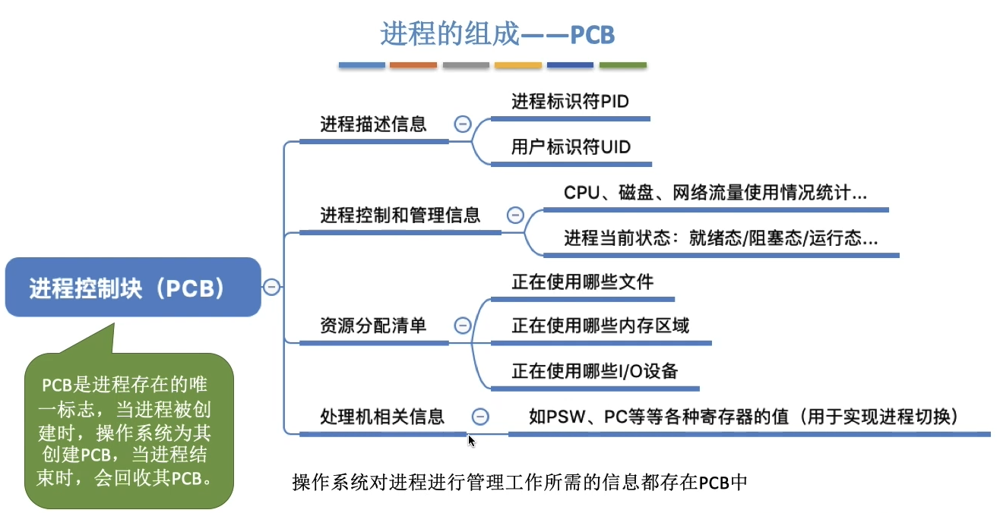

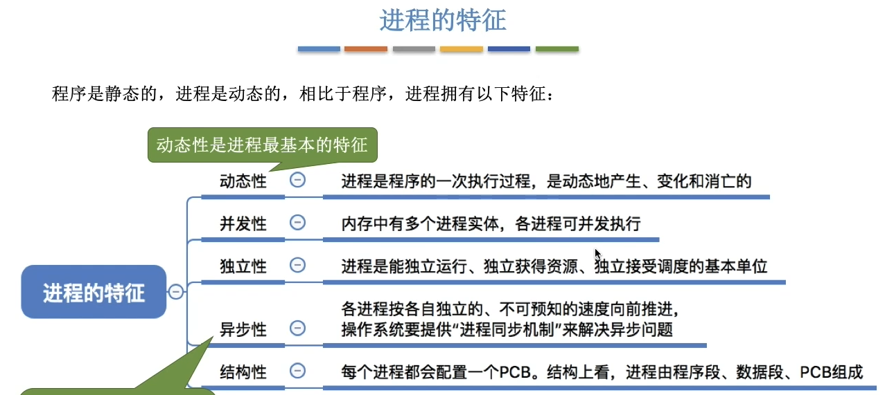

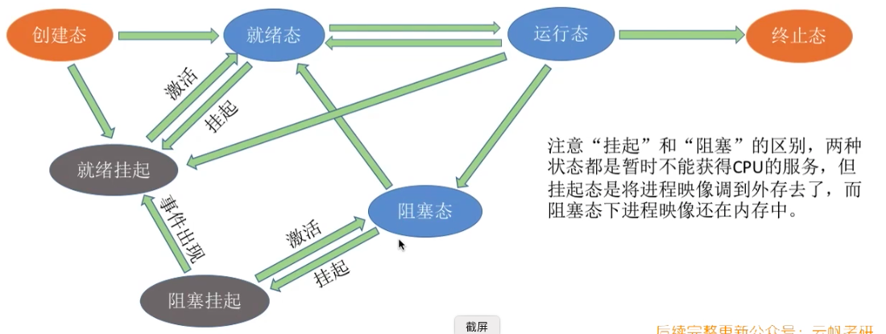

`进程状态的转换`

**别名**：阻塞态（等待态），创建态（新建态），终止态（结束态）

运行态 -> 阻塞态是一种进程的**主动行为**

阻塞态->就绪态是一种被动行为

**不能由阻塞态直接转换为运行态，也不能由就绪态直接转换为阻塞态**

### 

`进程控制`

**创建原语：**

**撤销原语**：

**阻塞原语**：（==运行态->阻塞态==）

**唤醒原语**：（==阻塞态->就绪态==）

​	1⃣️ 在事件等待队列中找到PCB

​	2⃣️ 

**切换原语**：（==运行态 <-> 就绪态==）

​	1⃣️ 将运行环境信息存入PCB

​	2⃣️ PCB移入相应队列

​	3⃣️ 选择另一个进程执行，并更新其PCB

​	4⃣️ 根据PCB恢复新进程所需的运行环境

**引起进程切换的事件**：

​	1⃣️ 当前进程时间片到

​	2⃣️ 更高优先级的进程到达

​	3⃣️ 当前进程主动阻塞

​	4⃣️ 当前进程终止

`进程通信`

* **共享存储**

	两个进程对共享空间的访问必须是==互斥==的

	* **基于数据结构的共享**

		是一种==低级通信==方式

	* **基于存储区的共享**

		是一种==高级通信==方式

* **管道通信**

	只能==半双工==通信；**要实现双向同时通信，则需要设置两个管道**

	==写满时，不能再写；读空时，不能再读==

	==没写满，不能读；没读空，不能写==

	==读进程只能有一个，写进程可以有多个==

* **消息传递**

	使用**发送/接收原语**

	* **直接通信方式**

		消息直接挂到接收进程的消息缓存队列上

	* **间接通信方式（信箱通信方式）**

		消息先发到中间实体（信箱）中

`线程`

​	1⃣️ **线程是一个基本的CPU执行单元，也是程序执行流的最小单位**

​	2⃣️ ==引入线程后，进程只作为除CPU之外的系统资源的分配单位==

​	3⃣️ **每个线程都有一个线程ID、线程控制块（TCB）**

​	4⃣️ **同一进程或不同进程内的线程都可以并发执行**

​		（同一进程中的线程切换，不会引起进程切换；不同进程中的线程切换，会引起进程切换）

​	5⃣️ **线程也有就绪、阻塞、运行三种基本状态**

​	6⃣️ ==线程没有自己独立的地址空间==

​	7⃣️ 系统发生死锁时进程可能都处于阻塞态，或无进程任务CPU空闲，**故某一时刻可能没有进程处于运行态**

​	8⃣️ **进程可以创建进程或线程，线程也可以创建线程，但线程不能创建进程**（都是一个或多个）

`多线程模型`

* **线程实现方式**

	* **用户级线程**

		线程切换在用户态下完成，无须操作系统干预

		优点：线程管理开销小，效率高

		缺点：当一个用户级线程被阻塞后，整个进程都会被阻塞；不能在多核处理机上运行

	* **内核级线程**

* **多线程模型**

	* **一对一模型**

		一个用户级线程映射到一个内核级线程

	* **多对一模型**

		多个用户线程映射到一个内核级线程，且一个进程只被分配一个内核级线程

	* **多对多模型**

		n用户级线程映射到m个内核级线程（n>=m）

`进程调度`

* **高级调度**（作业调度）

	按一定到原则从外存到作业后备队列中挑选一个作业调入内存，并创建进程

	频率较低

* **中级调度**（内存调度）

	按照某种策略决定将哪个处于挂起状态的进程重新调入内存

	频率较高

* **低级调度**（进程调度/处理机调度）

	按照某种策略从就绪队列中选取一个进程，将处理机分配给它

	频率很高

`进程调度的时机`

* **需要进行调度**

	* **进程主动放弃处理机**

		1⃣️ 进程正常终止

		2⃣️ 运行过程中发生异常而终止

		3⃣️ 进程主动请求阻塞

	* **进程被动放弃处理机**

		1⃣️ 时间片用完

		2⃣️ 有更紧急的事需要处理（如I/O中断）

		3⃣️ 更高优先级的进程进入就绪队列

* **不能进行调度**

	1⃣️ 处理中断的过程中

	2⃣️ 进程在操作系统内核程序临界区中（普通临界区中可以调度）

	3⃣️ 在原子操作过程中

### 第3章 内存管理

#### 内存管理概念

流程：<u>编译$$\rightarrow$$链接$$\rightarrow$$装入</u> 

`程序链接的三种方式`

* **静态链接**

    程序运行前，先将各目标模块及它们所需的库函数链接成一个完整的可执行程序，以后不再拆开

* **装入时动态链接**

    将各目标模块装入内存时，采用==边装入边链接==的链接方式

* **运行时动态链接**

    当程序执行中需要该目标模块时，才对它进行链接

    **优点：** ==便于修改和更新==，==便于实现对目标模块的共享==

`程序装入内存的三种方式`

* **绝对装入**

    在==编译时==，编译程序产生绝对地址的目标代码，==只适用于单道程序环境==

* **可重定位装入（静态重定位）**

    编译、链接后的装入模块的地址都是从0开始的，指令中使用的地址、数据存放的地址都是相对于起始地址而言的逻辑地址。

    地址变换是在==装入时==一次完成的

    **特点**：1⃣️装入内存时，需要==分配全部内存空间==

    ​				2⃣️整个运行期间==不能在内存中移动==

    ​				3⃣️==不能申请内存==

* **动态运行时装入（动态重定位）**

    编译、链接后的装入模块的地址都是从0开始的，装入内存后，并不会立即把逻辑地址转换为物理地址，而是把地址转换推迟到程序真正==执行时==才进行，需要一个**重定位寄存器**的支持，**用于早期的多道批处理系统**

    **特点：** 1⃣️==可以将程序分配到不连续的存储区中==

    ​				 2⃣️==只需装入部分代码即可运行==

    ​				 3⃣️==可动态申请分配内存==

`内存管理功能`

* **内存空间的分配和回收**

* **地址转换**

    逻辑地址 -> 物理地址

* **内存空间的扩充（实现虚拟性）**

* **存储保护（内存保护）**

    **目的：** 保证各道作业在各自的存储空间内运行，互不干扰

    * **设置一对上、下限寄存器**

        存放用户作业在主存中的上限、下限地址，每当CPU访问一个地址时，分别和两个寄存器的值相比，判断有无越界

    * **采用重定位寄存器（基址寄存器）和界地址寄存器（限长寄存器）进行越界检查**

        重定位寄存器存放起始**物理地址**，界地址寄存器存放**最大逻辑地址**

`覆盖与交换`

覆盖与交换技术是在**多道程序环境下**用来扩充内存的两种方法

* **覆盖**（同一个进程中的）

    把用户空间分成一个固定区和若干覆盖区，将经常活跃的部分放在固定区，那些即将访问的段放入覆盖区，其他段放在外存中，在需要调用前，系统再将其调入覆盖区，替换覆盖区中原有的段

    由程序员声明覆盖结构，操作系统自动完成覆盖，==只用于早期操作系统==

    **缺点：** ==对用户不透明==，增加了用户编程负担

* **交换技术**（不同进程之间的）

    内存空间紧张时，系统将内存中某些进程暂时换出外存，把外存中某些已具备运行条件的进程换入内存

    **换出**：把处于==等待状态==（或在CPU调度原则下被剥夺运行权利）的程序从内存移到辅存

    **换入**：把==准备好竞争CPU==运行的程序从辅存移到内存

    1⃣️ **应该将进程保存在外存的什么位置？**

    ​		通常把磁盘空间分为文件区和对换区；

    ​		**文件区**用于存放文件，采用==离散分配==方式（==追求存储空间的利用率==）

    ​		**对换区**存放被换出的进程数据，采用==连续分配==方式（==追求换入换出速度==）
    
    ​		**对换区的I/O速度比文件区更快**
    
    2⃣️ **PCB会常驻内存，不会被换出外存**

`连续分配管理方式`

**内部碎片**：分配给某进程的内存区域中，如果有些部分没有用上

**外部碎片**：内存中的某些空闲分区由于太小而难以利用

* **单一连续分配**

    内存被分为系统区和用户区；系统区用于存放操作系统相关数据，用户区用于存放用户进程相关数据

    ==内存中只能有一道用户程序==，用户程序独占整个用户区空间

    **优点：** 实现简单；==无外部碎片==，**可以采用覆盖技术扩充内存**，**无须进行内存保护**

    **缺点：** ==有内部碎片==[^22]，==只能用于单用户、单任务操作系统==，**存储器利用率极低** 

    
    
* **固定分区分配**

    * **分区大小相等**

    	用于利用一台计算机去控制多个相同对象的场合，**缺乏灵活性**

    * **分区大小不等**

    	根据系统中运行的作业大小情况进行划分（如划分多个小分区、适量中等分区、少量大分区)

    	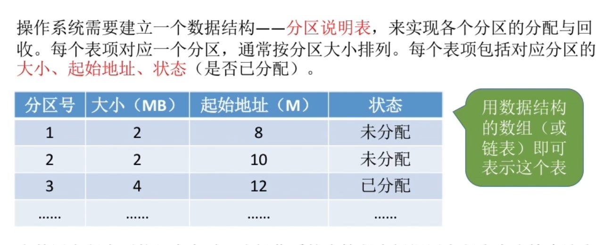

    **优点**：实现简单，==无外部碎片==

    **缺点**：1⃣️ 程序可能太大而放不进任何一个分区中，用户不得不使用覆盖技术来使用内存空间

    ​				2⃣️ 主存利用率低，==有内部碎片==

* **动态分区分配（可变分区分配）**

    不会预先划分内存分区，而是在进程==装入时==根据进程大小动态建立分区，并使分区大小正好适合进程的需要

    ==动态分区分配应使用动态重定位的装入方式==

    ==无内部碎片，有外部碎片==（外部碎片可以通过紧凑技术解决，即系统不时地对进程进行移动和整理，但需要动态重定位寄存器的支持）

### 第4章 文件管理

#### 文件系统基础

##### 逻辑结构

`无结构文件`

又称**流式文件**

`有结构文件`

又称**记录式文件**

每条记录由若干个数据项组成，根据各条记录的长度（占用的存储空间）是否相等，又可分为__定长记录__和__可变长记录__

①__顺序文件__

文件中的记录一个接一个地顺序排列（逻辑上），各个记录在物理上可以顺序存储或链式存储，记录可以是定长的或可变长的

__组织结构__:

* 串结构

    记录之间的顺序与关键字无关

* 顺序结构

    记录之间的顺序按关键字顺序排列

__是否可实现随机存取__:

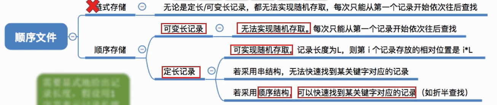

考试题目所说的“顺序文件”指的是__物理上顺序存储的顺序文件__

__缺点__: ==增加/删除一个记录比较困难==

②__索引文件__

对于可变长记录文件，系统开销较大，为此可以建立一张索引表以加快检索速度，__索引表本身是定长记录的顺序文件__

③__索引顺序文件__

跟索引文件一样会为文件建立一张索引表，不同的是：并不是每个记录对应一个索引表项，而是先分组，一组记录对应一个索引表项

**索引文件的索引表一定要保证按关键字有序排列，而索引顺序文件的索引表不一定有序**，因此查询索引顺序文件的索引表时，一般使用**顺序查找**

##### 文件目录

`文件控制块（FCB）`[^9]

文件目录：FCB的有序集合

一个FCB就是一个文件目录项

主要包含:

* 基本信息（文件名、文件的物理位置、文件的逻辑结构、文件的物理结构）
* 存取控制信息（__文件存取权限__）
* 使用信息（文件建立时间、修改时间）

`索引结点`

在文件目录中的每个目录项仅由文件名和指向该文件所对应的索引结点的指针构成

存放在磁盘上的索引结点称为__磁盘索引结点__；当索引结点放入内存后称为__内存索引结点__

`目录结构`

* **单级目录结构**

    实现了按名存取，但==不允许文件重名==，**查找速度慢、不便于文件共享**

    ==不适用于多用户操作系统==

* **两级目录结构**

    分为主文件目录和用户文件目录

    主文件目录：记录用户名及相应用户文件目录所在的存储位置

    用户文件目录：记录该用户的文件PCB信息

    ==允许不同用户的文件重名==，但__缺乏灵活性__，==不能对文件分类==

* **多级目录结构（树形目录结构）**

    不同目录下的文件可以重名，==便于实现文件分类==，但==不便于实现文件共享==

    **设置当前工作目录的目的**：加快文件的检索速度

* **无环图目录结构**

    可为每个共享结点设置一个共享计数器

    每当增加对该结点的共享链时，计数器加1；每当删除该结点时，计数器减1

    仅当计数器为0时，才真正删除该结点，否则仅删除请求用户的共享链

##### 文件的基本操作

`创建文件`

进行create系统调用时，需要提供的参数有：

1⃣️ 所需的外存空间大小  2⃣️ 文件存放路径  3⃣️ 文件名

* 在外存中找到文件所需的空间
* 创建该文件对应的目录项 

`删除文件`

进行delete系统调用时，需要提供的参数有：

1⃣️ 文件名  2⃣️ 文件存放路径 

* 找到文件名对应的目录项
* 回收文件占用的磁盘块
* 删除文件对应的目录项 

`打开文件`

进行open系统调用时，需要提供的参数有：

1⃣️ 文件名  2⃣️ 文件存放路径  3⃣️ 要对文件的操作类型（如 只读、读写）

* 在目录中找到文件名对应的目录项，并检查是否有指定的操作权限

* 将目录项复制到内存中的“打开文件表”中，并将表中编号返回给用户，之后用户使用编号指明要操作的文件

    系统的打开文件表中每个文件都有一个“打开计数器”，用以记录多少进程打开了该文件

`关闭文件`

1⃣️ 将进程的打开文件表相应表项删除

2⃣️ 回收分配给该文件的内存空间等资源

3⃣️ 系统打开文件表的打开计数器count减1，若count = 0，则删除对应表项:

`读文件`

进行read系统调用时，需要提供的参数有：

1⃣️ 哪个文件（文件描述符） 2⃣️ 读入多少数据 3⃣️ 放在内存的位置

read系统调用不需要提供文件名，而是文件描述符

`写文件`

进行write系统调用时，需要提供的参数有：

1⃣️ 哪个文件（文件描述符） 2⃣️ 写出多少数据 3⃣️ 数据存放在内存的位置

##### 文件共享

`基于索引结点的共享方式（硬链接）`

索引结点设置一个链接计数变量count

**各个用户的目录项指向同一个索引结点**

count>0时，用户删除文件只能将count减1，然后删除自己目录中的相应目录项，其他用户仍然可以使用该文件

count=0时，表示没有用户使用该文件，系统负责删除该文件

`基于符号链的共享方式（软链接）`

只有文件的拥有者才拥有指向其索引结点的指针，而共享该文件的其他用户只有该文件的路径名，

并不拥有指向其索引结点的指针

##### 文件保护

`口令保护`

口令一般存放在文件对应的FCB或索引结点中

__优点__：时间和空间开销不多

__缺点__：口令直接存在系统内部，不够安全

`加密保护`

__优点__：保密性强，节省了存储空间

__缺点__：加密、解密要花费一定的时间

`访问控制`

在每个文件的FCB（或索引结点）中增加一个访问控制列表，该表记录了各个用户可以对该文件执行哪些操作

#### 文件系统实现

##### 文件系统层次结构

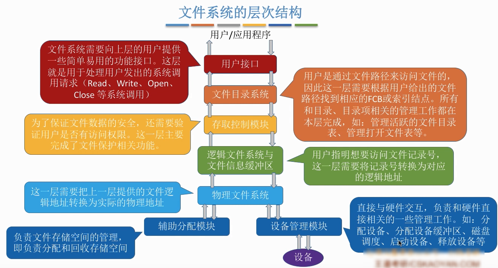

##### 文件分配方式（物理结构）

`连续分配`[^10]

每个文件在磁盘上占有一组连续的块

连续分配==支持顺序访问和直接访问（随机访问）==，只需访问磁盘一次

__优点__：实现简单、==存取速度快==

__缺点__：==不方便拓展==、==存储空间利用率低==、==会产生外部碎片==

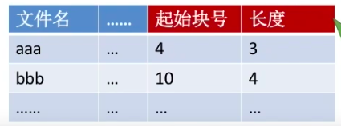

`链接分配`

* **隐式链接**

    __优点__：==方便文件拓展==，==不产生外部碎片==，==存储利用率高==

    __缺点__：无法直接访问盘块（__查找效率低__），只能通过指针顺序访问文件（读入i号逻辑块，需要i+1次磁盘I/O），且盘块指针会消耗一定存储空间（即==只支持顺序访问==），不产生碎片

    

* **显式链接**

    __文件分配表(FAT)__：==整个磁盘只设置一张==，每个表项存放对应块的下一块链接指针，即下一个盘块号，开机时，将FAT读入内存，并**常驻内存**

    从文件目录项中找到起始块号，查询内存中的文件分配表，找到逻辑块号对应的物理块号，__逻辑块号转换成物理块号的过程不需要读磁盘操作__

    ==既支持顺序访问，也支持随机访问==

    相比隐式链接，__文件访问效率更高__

    文件分配表__需要占用一定的存储空间__

    **不会产生外部碎片**，**方便空间拓展**
    
    

`索引分配`

__为每个文件建立一张索引表__，索引表记录了文件的各个逻辑块对应的物理块

索引表存放的磁盘块称为**索引块**，文件数据存放的磁盘块称为**数据块**

__缺点__：索引表(块)__需要占用一定的存储空间__

__优点__：==支持随机访问==，==没有外部碎片==，__容易实现文件拓展__

（索引块太小无法支持大文件，为解决此问题引入以下方案）

* **链接方案**

    将多个索引块链接起来（类似链表）

    ==效率低==

    

* **多层索引**

    > 假设磁盘块大小为1KB，一个索引表项占4B，则一个磁盘块只能存放256个索引项
    >
    > 若某文件采用两层索引，则该文件的最大长度？
    >
    > $256*256*1KB = 65536KB = 64MB$ 

    ==采用k层索引结构，且顶级索引表未调入内存，则访问一个数据块只需要k+1次读磁盘操作==

    __缺点__：==即使是小文件，访问一个数据块依然需要k+1次读磁盘==

    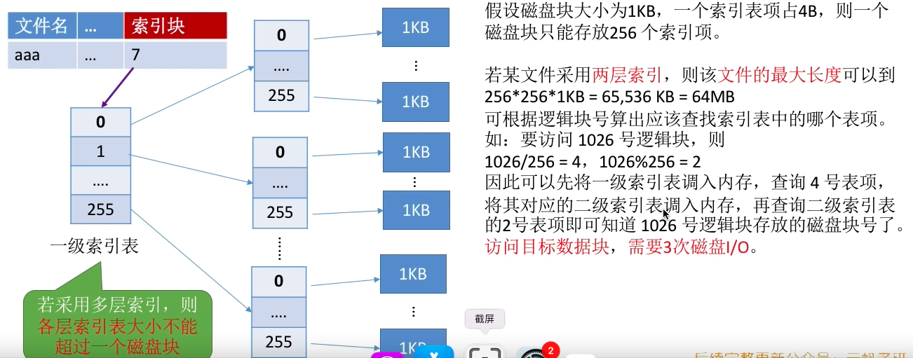

* **混合索引**

    

    若顶级索引表还未读入内存，则

    ①访问0\~7号逻辑块：两次读磁盘
    
    ②访问8\~263：三次
    
    ③访问264~65799：四次
    
    __优点__：对于小文件，读磁盘次数更少

##### 文件存储空间管理

`空闲表法`

==适用于连续分配方式==

`空闲链表法`

①__空闲盘块链__[^11]

==操作系统保存着链头、链尾指针==

空闲盘块中存储着下一个空闲盘块的指针

==适用于离散分配的物理结构==

**分配**：从链头开始摘下k个盘块，并修改空闲链的链头指针

**回收**：回收的盘块依次挂到链尾，并修改链尾指针

②__空闲盘区链__[^12]

==操作系统保存链头、链尾指针==

空闲盘区中的第一个盘块内记录了盘区的长度、下一个盘区的指针

**如何分配**：若某文件申请K个盘块，则可以采用首次适应、最佳适应等算法，从链头开始检索，按照算法规则找到一个大小符合要求的空闲盘区，分配给文件。若没有合适的连续空闲块，也可以将不同盘区的盘块同时分配给一个文件，注意分配后可能要修改相应的链指针、盘区大小等数据

**如何回收**：若回收区和某个空闲盘区相邻，则需要将回收区合并到空闲盘区中。若回收区没有和任何空闲区相邻，将回收区作为单独的一个空闲盘区挂到链尾

==离散分配、连续分配都适用==

`位示图法`

==连续分配、离散分配都适用==

__盘块号、字号、位号从0开始__：

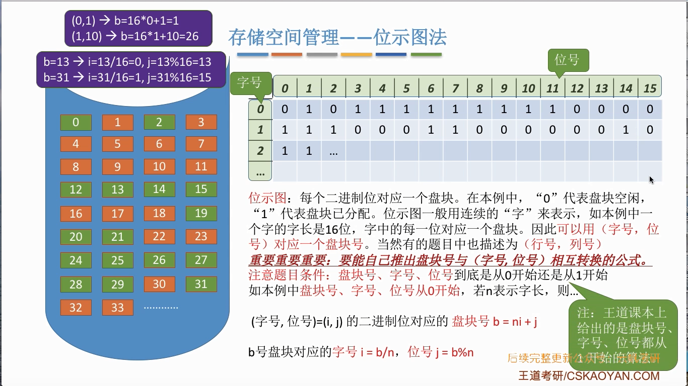

__盘块号、字号、位号从1开始__：

$b=n(i-1)+j$

$i=(b-1)/n+1$

$j=(b-1)\%n+1$

**如何分配**：（若文件需要k个块）

1⃣️ 顺序扫描位示图，找到K个相邻或不相邻的“0”

2⃣️ 根据字号、位号算出对应的盘块号，将相应盘块分配给文件

3⃣️ 将相应位设置为“1”

**如何回收:**

1⃣️ 根据回收的盘块号计算出对应的字号、位号

2⃣️ 将相应二进制位设为“0”

`成组链接法`

①__如何分配__

②__如何回收__

`其他`

==空闲表法和空闲链表法都不适用于大型文件系统（因为空闲表或空闲链表可能过大）==

#### 磁盘组织与管理

##### 磁盘的结构

`概念`

__磁道__：（一个圈）

__扇区__：（扇形内的一行）又称盘块，__每个扇区固定存储大小__（通常512B）

​					密度从最外道向里道增加（最内侧的扇区面积最小，因此__数据密度最大__）

__磁头__：每个盘面对应一个磁头，所有磁头固定在一起，与磁盘中心的距离相同且__一起移动__

__柱面__：所有盘片上相对位置相同的磁道组成柱面

__活动头磁盘__：磁头可以移动，磁臂可以来回伸缩来带动磁头定位磁道

__固定头磁盘__：磁头不可移动，每个磁道有一个磁头

__可换盘磁盘__：盘片可以更换

__固定盘磁盘__：盘片不可更换

##### 磁盘调度算法

###### 性能参数

`寻找时间`[^13]

n：跨越的磁道数

m：每跨越一个磁道的耗时，约为0.2ms

s：磁臂的启动时间，约为2ms

$T_s=m\times n + s$

`旋转延迟时间`[^14]

r：磁盘的旋转速度

$T_r=\frac{1}{2}\times\frac{1}{r}=\frac{1}{2r}$

`传输时间`[^15]

r：磁盘的旋转速度

b：读/写的字节数

N：每个磁道上的字节数

$T_t=\frac{1}{r}\times\frac{b}{N}=\frac{b}{rN}$

`其他`

延迟时间和传输时间都与磁盘旋转速度相关，且为线性相关；而转速是硬件固有属性，因此操作系统也无法优化延迟时间和传输时间

###### 调度算法

`先来先服务算法（FCFS）`[^16]

__优点__：公平

__缺点__：==性能差，寻道时间长==

`最短寻找时间优先（SSTF）`[^17]

__优点__：性能较好（比FCFS算法好），平均寻道时间较短

__缺点__：==可能产生饥饿现象==（原因：磁头在一个小区域内来回来去地移动）

`扫描算法（SCAN）`[^18]

__只有磁头移到最外侧磁道的时候才能往内移动，移到最内才能往外移动__

__优点__：性能较好，平均寻道时间较短

__缺点__：①只有到达最边上的磁道时，才能改变磁头移动方向

​				②==对各个位置磁道的响应频率不平均==

`循环扫描算法（C-SCAN）`[^20]

`LOOK调度算法`[^19]

`C-LOOK调度算法`[^21]

`其他`

__若题目无特别说明，则SCAN就是LOOK，C-SCAN就是C-LOOK__

#####  磁盘的管理

`磁盘初始化`

* 低级初始化（物理初始化）

    将磁盘的各个磁道划分为扇区，一个扇区可分为头、数据区域、尾三部分

    管理扇区所需要的各种数据结构一般存放在头、尾两部分，包括扇区校验码

* 将磁盘分区

    每个分区由若干个柱面组成

* 逻辑格式化

    创建文件系统，包括创建文件系统的根目录、初始化存储空间管理所用的数据结构（如位示图、空闲分区表）

`引导块`

`坏块`

* 对于简单的磁盘，可以在逻辑格式化时对整个磁盘进行坏块检查，在FAT表上会标明（坏块对系统不透明）
* 对于复杂的磁盘，进行低级格式化时将一些块保留作为备用（对系统透明），这种方案称为__扇区备用__

### 第5章 I/O管理

#### I/O管理概述

`I/O设备分类`

①__按使用特性__

* __人机交互类外部设备__

    鼠标、键盘    

    **数据传输速度慢**

* __存储设备__

    磁盘     

    **速度较快**

* __网络通信设备__

    调制解调器
    
    数据传输速度介于上述两者之间

②__按传输速率__

* **低速设备**

	鼠标、键盘

* **中速设备**

	打印机

* **高速设备**

	磁盘

③**按信息交换单位**

* **块设备**

    磁盘	

    **数据传输基本单位**：==块==

    传输速率较高，==可寻址==（即可随机地读/写任一块）

* 字符设备

    鼠标，键盘	
    
    **数据传输基本单位**：==字符==
    
    传输速率较低，==不可寻址==，常采用==中断驱动方式==

`I/O控制器`

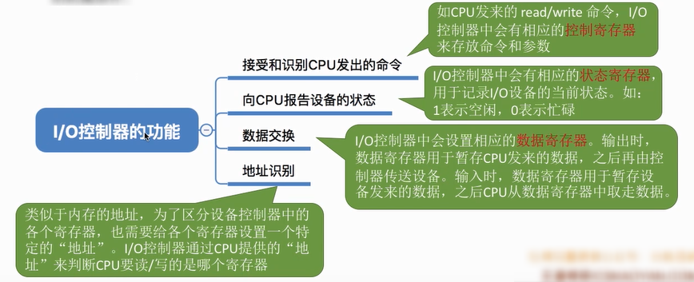

**注意**：

1⃣️ 一个I/O控制器可能对应多个设备

2⃣️ 数据寄存器、控制寄存器、状态寄存器可能有多个（对应各个设备），且这些寄存器都要有相应的地址

**编址方式：**

* **内存映像I/O**

	占用内存地址的一部分

* **寄存器独立编址**

	采用I/O专用地址

`I/O软件层次结构`

==（需要记住各个层次之间的顺序）==

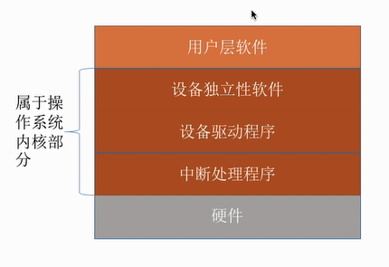

* __用户层软件__

    用户层软件实现了**与用户交互的接口**，用户可直接使用该层提供的、与I/O操作相关的库函数对设备进行操作

* __设备独立性软件__

    也称__设备无关性软件__

    ①**向上层提供系统调用**

    ②**设备保护**（访问权限等）

    ③**差错处理**（对设备产生的错误进行处理）

    ④**设备的分配与回收**

    ⑤**数据缓存区管理**（可以通过缓冲技术屏蔽设备之间数据交换单位大小和传输速度的差异）

    ⑥**建立逻辑设备到物理设备名的映射关系，根据设备类型选择调用相应的驱动程序**

    

    ​	系统可以采用两种方式管理逻辑设备表（LUT）：

    ​	1⃣️ 整个系统只设置一张LUT

    ​			意味着所有用户不能使用相同的逻辑设备名，故只适用于单用户系统

    ​	2⃣️ 为每个用户设置一张LUT

    ​			各个用户使用的逻辑设备名可以重复，适用于多用户操作系统

* **设备驱动程序**

    设置设备寄存器，检查设备状态

* **中断处理**

* **硬件设备**

    通常包括一个机械部件和一个电子部件（I/O控制器）

`I/O核心子系统`

__提供的服务__：==I/O调度、缓冲与高速缓存、设备分配与回收、假脱机、设备保护和差错处理==

`假脱机技术(spooling技术)`

**输入井**：用于收容I/O设备输入的数据

**输出井**：用于收容用户进程输出的数据

**输入缓冲区**：在输入进程的控制下，输入缓冲区用于暂存从输入设备输入的数据，之后再转存到输入井中

**输出缓冲区**：在输出进程的控制下，输出缓冲区用于暂存从输出井送来的数据，之后再传送到输出设备上

**（输入、输出缓冲区是在内存中的缓冲区）**

[^1]:  虚拟存储、虚拟处理器之类
[^2]: 在多道程序环境下，由于资源有限，进程的执行不是一贯到底的，而是走走停停，它以不可预知的速度向前推进
[^3]: 作业自动运行，无需人工干预
[^4]: 先调入内存的作业先完成
[^5]: 内存中仅有一道程序运行

[^7]: fault，由错误条件引起，可被修复继续执行
[^8]: abort，由致命错误引起，无法修复，如整数除0、非法使用特权指令
[^9]: 用来存放控制文件需要的各种信息的数据结构
[^10]: 每个文件在磁盘上占有一组连续的块
[^11]: 以盘块为单位组成一条空闲链
[^12]: 以盘区为单位组成一条空闲链，连续的空闲盘块组成一个空闲盘区
[^13]: 又称寻道时间，指活动头磁盘在读写信息前，将磁头移动到指定磁道所需要的时间
[^14]: 指磁头定位到某一磁盘的扇区所需要的时间
[^15]: 指从磁盘读出或向磁盘写入数据所经历的时间
[^16]: 根据进程请求访问磁盘的先后顺序进行调度
[^17]: 优先处理与当前磁头最近的磁道
[^18]: 又称电梯算法，磁头当前移动方向上选择与当前磁头所在磁道距离最近的请求作为下一次服务的对象
[^19]: SCAN算法的改进，如果在磁头移动方向上已经没有别的请求，就可以立即改变磁头移动方向
[^20]: 规定只有磁头朝某个特定方向移动时才处理磁道访问请求，只有到了最边上的磁道才能改变磁头移动方向，而返回时直接快速移动至起始端而不处理任何请求
[^21]: 如果磁头移动的方向上已经没有磁道访问请求，就可以让磁头返回，且磁头只需要返回到有磁道访问请求的位置即可
[^22]: 分配给某进程的内存区域中，如果有些部分没有用上，就是内部碎片

