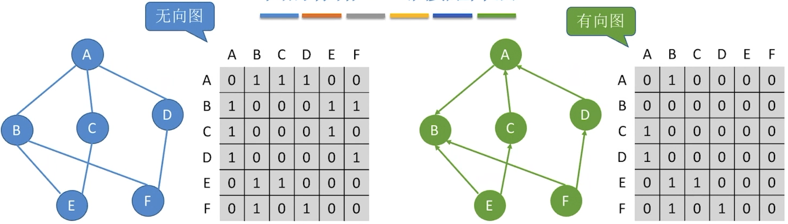

### 第6章 图

`概念`

**阶**：图中顶点的个数				线性表可以是空表，树可以是空，但<u>图不可以为空</u>，图的顶点集一定非空，但边集可以为空

**简单图**：不存在重复边、不存在顶点到自身的边   **多重图**：某两个结点之间的边数多于1，又允许顶点通过同一条边和自己关联

**顶点的度**：1⃣️ 对于无向图，顶点v的度是指依附于该顶点的边的条数，记为TD(v)；==无向图的全部顶点的度的和等于边数的两倍==

​						 2⃣️ 顶点v的度等于其入度和出度之和，TD(v) = ID(v) + OD(v)；==入度的和 = 出度的和 = 边数==

**回路**：第一个顶点和最后一个顶点相同的路径称为回路或环

**简单路径**：在路径序列中，顶点不重复出现的路径称为简单路径

**简单回路**：除第一个顶点和最后一个顶点外，其余顶点不重复出现的回路称为简单回路            **路径长度**：路径上边的数目

**点到点的距离**：从顶点u出发到顶点v的最短路径若存在，则此路径的长度称为从u到v的距离

​								   若从u到v根本不存在路径，则记该距离为无穷(∞)

**连通**：无向图中，若从顶点v到顶点w有路径存在，则称v和w是连通的；若图中任意两个顶点都是连通的，则称为连通图

​				对于n个顶点的无向图，==若为连通图，则最少有n-1条边（树形）；若为非连通图，则最多有$C^2_{n-1}$条边==

**强连通**：有向图中，若从顶点v到顶点w和从顶点w到顶点v之间<u>都有路径</u>，则称这两个顶点是强连通的

​					若图中任何一对顶点都是强连通的，则称此图为强连通图

​					==对于n个顶点的有向图，若为强连通图，则最少有n条边==（即为环形）

**子图**：图中任意挑几个顶点及它的边				**生成子图**：包含了图中所有顶点，但去掉了几条边


**连通分量**：无向图中的极大连通子图（子图必须连通，且包含尽可能多的顶点和边）


**强连通分量**：有向图中的极大强连通子图（子图必须强连通，同时保留尽可能多的边）


**生成树**：连通图的生成树是包含图中全部顶点的一个极小连通子图（边尽可能的少，但要保持连通）

​					若图中顶点数为n，则它的生成树含有n-1条边。对生成树而言，若砍去它的一条边，则会变成非连通图，

​					若加上一条边则会形成一个回路


**生成森林**：在非连通图中，连通分量的生成树构成了非连通图的生成森林


**边的权值**：在一个图中，每条边都可以标上具有某种含义的数值，该数值称为该边的权值；边上带有权值的图称为带权图（或网）

**带权路径长度**：当图是带权图时，一条路径上所有边的权值之和，称为该路径的带权路径长度

**无向完全图**：无向图中任意两个顶点之间都存在边；<u>若有n个顶点，则边有$C^2_n$条</u>

**有向完全图**：有向图中任意两个顶点之间都存在方向相反的两条弧；<u>若有n个顶点，则边有$2C^2_n$条</u>

**稀疏图**：边数很少的图；反之称为<u>稠密图</u>

**树**：不存在回路，且连通的无向图        ==n个顶点的树，必有n-1条边==；<u>n个顶点的图，若边数 > n-1，则一定有回路</u>

**有向树**：一个顶点的入度为0、其余顶点的入度均为1的有向图


`邻接矩阵法`

无向图中，0代表两点不连接，1代表两点连接；<u>第i个结点的度 = 第i行(或第i列)的非零元素个数</u>

有向图中$A\to B$，A行B列为1，B行A列为0；<u>第i个结点的出度 = 第i行的非零元素个数；第i个结点的入度 = 第i列的非零元素个数</u>

<u>第i个结点的度 = 第i行、第i列的非零元素个数之和</u>

<u>表示方式唯一</u>；==适合存储稠密图==（边数多的）



（无向图为对称矩阵，有向图为非对称矩阵）

`邻接表法`

（无向图：链表存储结点的所有边；有向图：链表存储以该结点为起点的边）


<u>图的邻接表表示方式并不唯一</u>；适合存储稀疏图（边数少的）

`十字链表法`


`最小生成树`


`简单选择排序`

（每一趟在待排序元素中选取关键字最小/最大的元素加入前面有序子序列的后面，必须进行总共n-1趟处理）

**时间复杂度**：==$O(n^2)$==           **稳定性**：==不稳定==            ==既可以用于顺序表，也可以用于链表==

==每趟确定一个元素的最终位置==

`归并排序`

（把两个或多个已经有序的序列合并成一个；**稳定性**：稳定）


==m路归并，每选出一个元素需要对比关键字m-1次==；==$n个元素进行2路归并排序，归并趟数= \lceil log_2n\rceil$==

==$每趟归并时间复杂度为O(n)，则算法时间复杂度为O(nlog_2n)；空间复杂度=O(n)，来自于辅助数组B$==

第一趟结束后，两两有序；第二趟结束后， 四四有序（可用来判断某排序结果是否使用归并排序）

```c
int *B = (int *)malloc(n*sizeof(int)); 										//辅助数组B

//A[0w.mid]和A. [mi+...high]各自有序,将两个部分归并
void Merge(int A[],int low, int mid,int high){
	int i,j,k;
	for( k=low; k<=high; k++)
		B[k] = A[k];														//将A中所有元素复制到B中
	for(i=low, j=mid+1, k=i; i<=mid && j<=high; k++){
		if(B[i]<=B[j])
			A[k] = B[i++]; 													//将较小值复制到A中
		else
			A[k] = B[j++];
		}
	while(i<=mid)	A[k++]=B[i++];											//没有归并完的部分复制到尾部
	while(j<=high) 	A[k++]=B[j++];
}

void MergeSort(int A[],int low, int high){
	if(low<high){
		int mid=(low+high)/2; 												//从中间划分
		MergeSort (A,low,mid); 												//对左半部分归并排序
		MergeSort (A,mid+1,high);											//对右半部分归并排序
		Merge(A, low, mid, high); 											//归并
	}
}
```


​    

`堆排序`

**大根堆**：完全二叉树中，$根\ge 左、右$							**小根堆**：完全二叉树中，$根\le 左、右$

<u>基于大根堆的堆排序得到‘递增序列”，基于小根堆的堆排序得到‘‘递减序列”</u>

**建立大根堆**

**思路**：（把所有非终端结点都检查一遍，是否满足大根堆的要求，如果不满足，则进行调整）

​			 1⃣️ （$从i\le [\frac{n}{2}]开始往前$）检查当前结点是否满足$根\ge左、右$；若不满足，将当前结点与更大的一个孩子互换

​			 2⃣️ 若元素互换破坏了下一级的堆，则采用相同的方法继续往下调整（小元素不断“下坠"）

​			 ==若元素下方有两个孩子，则“下坠”一层，需对比关键字2次；下方只有一个孩子，则“下坠”一层，只需对比关键字1次==


```c
//建立大根堆
void BuitdMaxHeap(int A[],int len){
	for(int i=len/2;i>0;i--) 									//从后往前调整所有 非终端结点
		HeadAdjust(A,i, len);
}
//堆排序的完整逻辑
void HeapSort(int A[], int len){
	BuildMaxHeap(A, len);										//初始建堆
	for(int i=len;i>1;i--){										//n-1趟的交换和建堆过程
		swap(A[i],A[1]);										//堆顶元素和堆底元素交换
		HeadAdjust(A,1,i-1);									//把剩余的待排序元素整理成堆
	}
}
//将以k为根的子树调整为大根堆
void HeadAdjust(int A[] ,int k,int len){
	A[0]=A[k];													//A[0]暂存子树的根结点
	for(int i=2*k;i<=len;i*=2){ 								//沿key较大的子结点向下筛选
		if(i<len && A[i]<A[i+1])
			i++;												//取key较大的子结点的下标
		if(A[0]>=A[i]) break; 									//筛选结束
		else{
			A[k]=A[i];											//将A[i]调整到双亲结点上
			k=i;												//修改K值，以便继续向下筛选
		}
	}
	A[k]=A[0];													//被筛选结点的值放入最终位置
}
```

==构建初始堆的时间复杂度$O(n)$，堆排序的时间复杂度$O(nlog_2n)$==

**插入**：对于小根堆，新元素放到表尾，与父节点对比，若新元素比父节点更小，则将二者互换；新元素就这样一路“上升”，直到无法继续上升为止

**删除**：被删除的元素用堆底元素替代，若该元素比其孩子更小，则将该元素与更小的孩子互换，然后该元素不断“下坠”，直到无法下坠为止

==插入、删除的时间复杂度都是$O(log_2n)$==

`散列查找`

散列表：又称哈希表

若不同的关键字通过散列函数映射到同一个值，则称它们为“同义词”

通过散列函数确定的位置已经存放了其他元素，则称这种情况为“冲突”

==装填因子a = 表中记录数/散列表长度==
